# PAGI Chat Desktop - Comprehensive Guide

> **A polyglot microservices architecture** designed for fast iteration on an **agent + tools + gateway + memory** backend system.

---

## Table of Contents

1. [Overview](#overview)
2. [Architecture Diagram](#architecture-diagram)
3. [Services Overview](#services-overview)
4. [Request Flow](#request-flow)
5. [Technology Stack](#technology-stack)
6. [Getting Started](#getting-started)
7. [Frontend Application & User Interface](#-frontend-application--user-interface)
8. [Service Details](#service-details)
9. [API Endpoints](#api-endpoints)
10. [Development Guide](#development-guide)
11. [Troubleshooting](#troubleshooting)
12. [Appendix: Production Build & Deployment](#appendix-production-build--deployment)

> **📚 For detailed architecture documentation, implementation choices, and production recommendations, see [`docs/PROJECT_DELIVERY_SUMMARY.md`](docs/PROJECT_DELIVERY_SUMMARY.md)**

---

## Overview

PAGI Digital Twin implements a **Tri-Layer Sovereign Architecture** with an explicit observability plane, designed for production-grade agent orchestration, secure tool execution, and persistent memory management.

### Architecture Layers

The system is organized into four distinct layers:

1. **Gateway Layer** (Edge Protocol + UI Integration)
   - **Rust Gateway** - WebSocket ingress, HTTP proxy, SSE telemetry proxy
   - Single entry point for frontend connections
   - Protocol translation and request routing

2. **Orchestrator Layer** (Planning + Policy Mediation)
   - **Rust Orchestrator** - Structured planning via OpenRouter with deterministic fallback
   - Human-in-the-loop (HITL) gating for memory queries and tool execution
   - Single decision point for agent actions

3. **Infrastructure Layer** (Memory + Tool Execution + Data Stores)
   - **Rust Memory Service** - Qdrant-backed vector storage (Neural Archive)
   - **Rust Tools Service** - Secure tool execution with bubblewrap sandboxing
   - **Qdrant DB** - Production-grade vector database for persistent memory

4. **Observability Plane** (Telemetry + Tracing/Metrics)
   - **Rust Telemetry Service** - Real-time host telemetry via SSE
   - **Jaeger** - Distributed tracing
   - **Prometheus** - Metrics collection and alerting

### Technology Stack

The system leverages multiple programming languages to optimize for each layer:

- **Rust** - Gateway, Orchestrator, Memory, Tools, Telemetry (performance, security, memory safety)
- **Go** - Legacy Agent Planner, Model Gateway, BFF (high-performance HTTP/gRPC services)
- **Python** - Legacy Memory Service, Agent (rapid prototyping, AI/ML ecosystem)
- **gRPC** - Efficient inter-service communication
- **Qdrant** - Production vector database for semantic memory

### Runtime Profiles

This repo supports multiple deployment profiles:

1. **Docker Compose (Production / Recommended)**
   - Full Tri-Layer architecture with all services
   - Qdrant-backed memory, bubblewrap sandboxing
   - Complete observability stack (Jaeger, Prometheus)
   - See [`docker-compose.yml`](docker-compose.yml:1)

2. **Bare Metal (Development)**
   - Runs core services directly without Docker
   - Faster iteration for development
   - See [`scripts/run_all_dev.py`](scripts/run_all_dev.py:1)

3. **Legacy Demo Stack (Deprecated)**
   - Go BFF + Python Agent demo stack
   - Maintained for backward compatibility
   - See [`scripts/run_all_dev.py`](scripts/run_all_dev.py:1) (`--profile legacy`)

---

## Architecture Diagram

### Tri-Layer Sovereign Architecture (Production Stack)

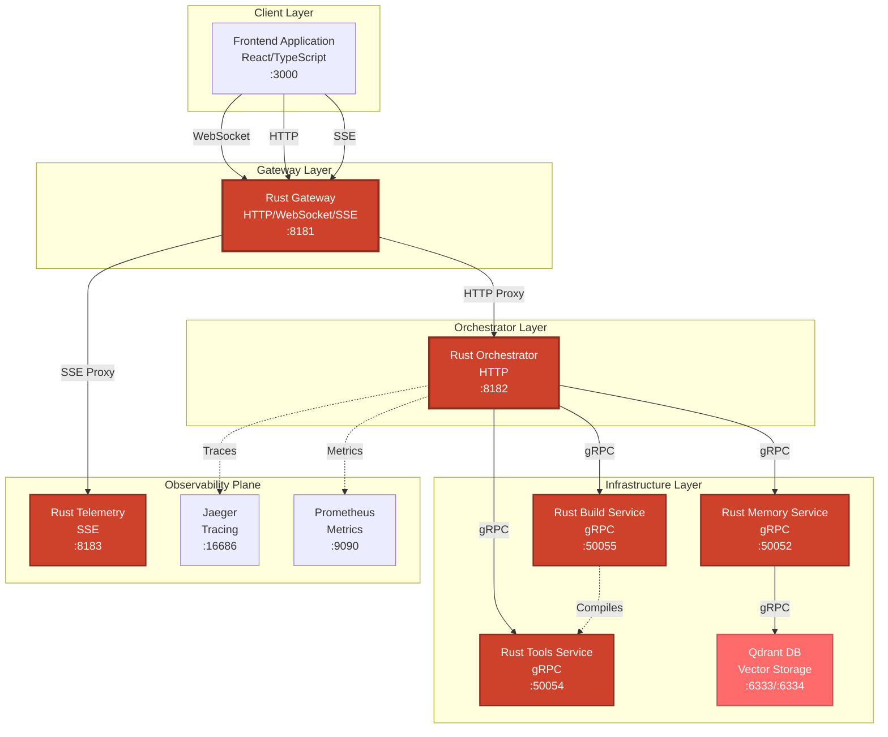

### Legacy Architecture (Agent Planner Stack)

> **Note:** This architecture is maintained for backward compatibility. New deployments should use the Tri-Layer architecture above.

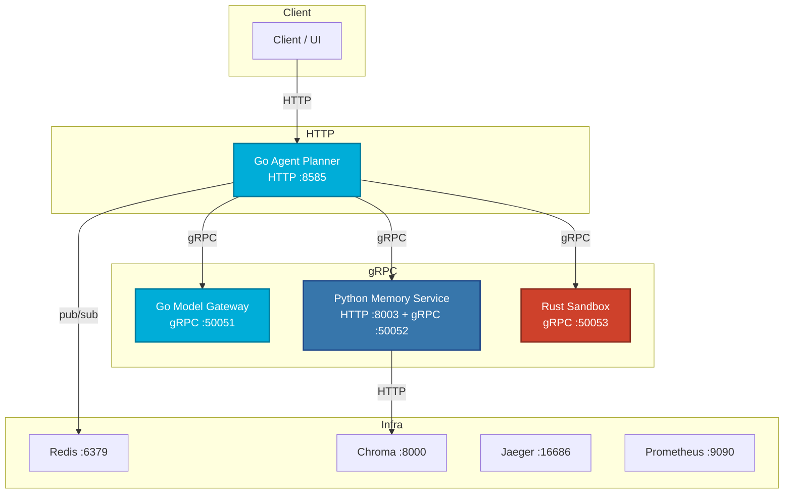

### Bare-metal dev harness profile (BFF + Python Agent demo)

> This is the older “fan-out BFF” demo stack started by [`make run-legacy-dev`](Makefile:1) / [`scripts/run_all_dev.py`](scripts/run_all_dev.py:1).

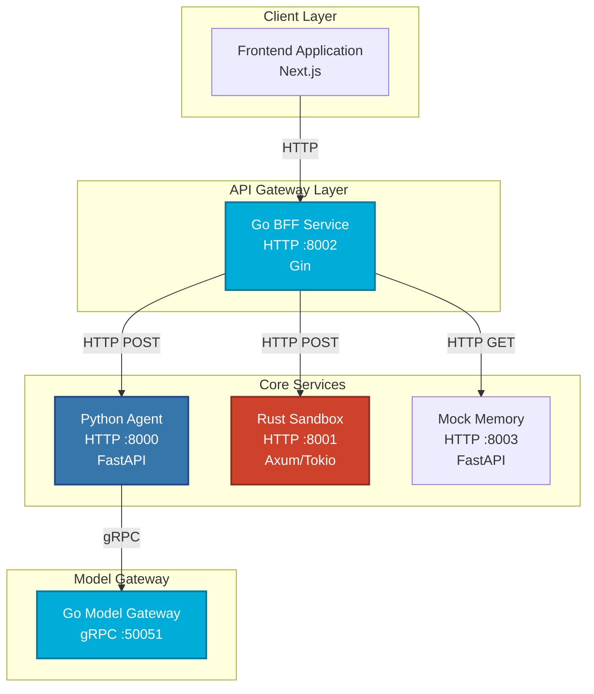

---

## Services Overview

### Tri-Layer Architecture Services (Production Stack)

#### Gateway Layer

| Service | Language | Framework | Ports | Purpose | Key Features |
|---------|----------|-----------|-------|---------|--------------|
| **Rust Gateway** | Rust | Axum | 8181 (HTTP/WebSocket/SSE) | Edge protocol + UI integration | • WebSocket ingress for real-time chat<br>• HTTP proxy to Orchestrator<br>• SSE proxy for telemetry streaming<br>• Single entry point for frontend |

#### Orchestrator Layer

| Service | Language | Framework | Ports | Purpose | Key Features |
|---------|----------|-----------|-------|---------|--------------|
| **Rust Orchestrator** | Rust | Axum | 8182 (HTTP) | Planning + policy mediation | • Structured planning via OpenRouter<br>• Human-in-the-loop (HITL) gating<br>• Deterministic fallback for offline work<br>• Typed JSON action contracts |

#### Infrastructure Layer

| Service | Language | Framework | Ports | Purpose | Key Features |
|---------|----------|-----------|-------|---------|--------------|
| **Rust Memory Service** | Rust | gRPC | 50052 (gRPC) | Neural Archive vector storage | • Qdrant-backed persistent memory<br>• Namespace-based collections<br>• Operational heartbeat monitoring<br>• Mandatory fail-fast on startup |
| **Rust Tools Service** | Rust | gRPC | 50054 (gRPC) | Secure tool execution | • Bubblewrap OS-level sandboxing (Linux)<br>• Cross-platform cwd isolation<br>• Policy-based authorization<br>• Hard timeout enforcement |
| **Rust Build Service** | Rust | gRPC | 50055 (gRPC) | Tool compilation and creation | • High-privilege code writing and compilation<br>• Queue-based build limiting (backpressure)<br>• Automatic Cargo.toml generation<br>• Tool name sanitization for security |
| **Qdrant DB** | N/A | qdrant | 6333 (REST) / 6334 (gRPC) | Production vector database | • High-performance similarity search<br>• Persistent storage volumes<br>• Multi-tenant namespace support<br>• Production-grade reliability |

#### Observability Plane

| Service | Language | Framework | Ports | Purpose | Key Features |
|---------|----------|-----------|-------|---------|--------------|
| **Rust Telemetry Service** | Rust | Axum | 8183 (SSE) | Real-time host telemetry | • CPU, Memory, GPU, Network metrics<br>• Server-Sent Events streaming<br>• Low-latency monitoring |
| **Jaeger** | N/A | jaeger | 16686 (UI) / 4317-4318 (ports) | Distributed tracing | • Request tracing across services<br>• Performance bottleneck identification<br>• Debugging complex flows |
| **Prometheus** | N/A | prometheus | 9090 | Metrics collection | • System metrics scraping<br>• Alerting rule evaluation<br>• Historical metric storage |

### Legacy Services (Backward Compatibility)

| Service | Language | Framework | Ports | Purpose | Status |
|---------|----------|-----------|-------|---------|--------|
| **Go Agent Planner** | Go | chi | 8585 | Legacy agent loop entrypoint | Deprecated |
| **Go Model Gateway** | Go | gRPC | 50051 | LLM model gateway | Maintained |
| **Python Memory Service** | Python | FastAPI | 8003 (HTTP) / 50052 (gRPC) | Legacy memory (Chroma-backed) | Deprecated |
| **Rust Sandbox** | Rust | Axum + gRPC | 50053 (gRPC) / 8001 (HTTP) | Legacy tool execution | Deprecated |
| **Chroma DB** | N/A | chroma | 8000 | Legacy vector store | Being phased out |
| **Redis** | N/A | redis | 6379 | Async notifications | Optional |
| **Notification Service** | Go | N/A | N/A | Redis notification subscriber | Optional |

### Bare-metal dev harness services

| Service | Language | Framework | Port | Purpose |
|---------|----------|-----------|------|---------|
| **Go BFF** | Go | Gin | 8002 | Fan-out aggregator for demo UI |
| **Python Agent** | Python | FastAPI | 8000 | Demo agent planning (calls model gateway) |
| **Rust Sandbox** | Rust | Axum/Tokio | 8001 | Demo HTTP tool execution |
| **Mock Memory** | Python | FastAPI | 8003 | Mock memory service for local dev demo |
| **Go Model Gateway** | Go | gRPC | 50051 | LLM model gateway (gRPC service) |

---

## Request Flow

### Tri-Layer Architecture Request Flow (Production)

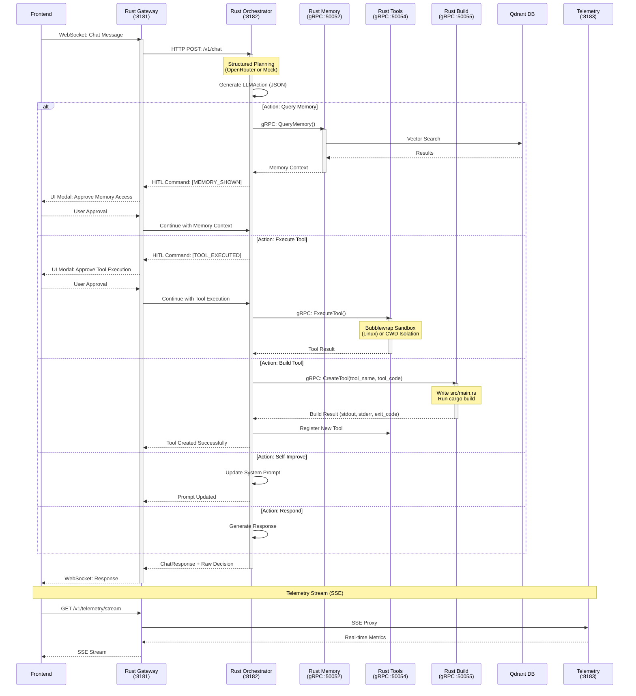

**Key Flow Characteristics:**
- **Human-in-the-Loop (HITL):** Memory queries and tool executions require explicit user approval
- **Structured Planning:** Orchestrator uses OpenRouter with JSON response format for deterministic parsing
- **Fail-Safe Fallback:** Mock planner available when OpenRouter is unavailable
- **Self-Developing Capabilities:** Orchestrator can create new tools (via Build Service) and improve its own system prompt
- **Observability:** All actions are traceable via Jaeger and metered via Prometheus

### Legacy Agent Planner Request Flow

> **Note:** This flow is maintained for backward compatibility.

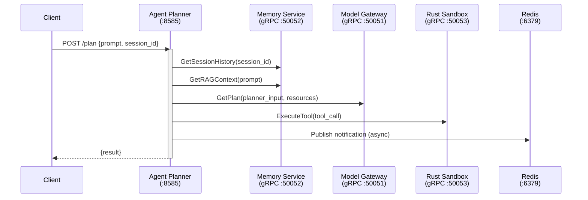

### Main Dashboard request flow (Bare-metal dev harness)

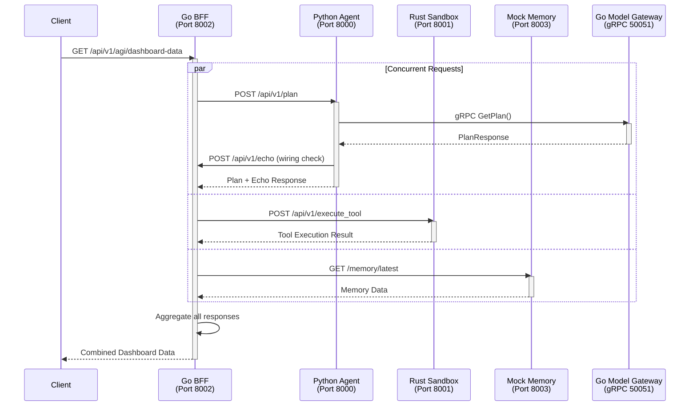

**Key Points:**
- The BFF makes **3 concurrent requests** to improve performance
- Python Agent calls Model Gateway via **gRPC** (faster than HTTP)
- The echo call is a **non-recursive wiring check** to verify connectivity

---

## Technology Stack

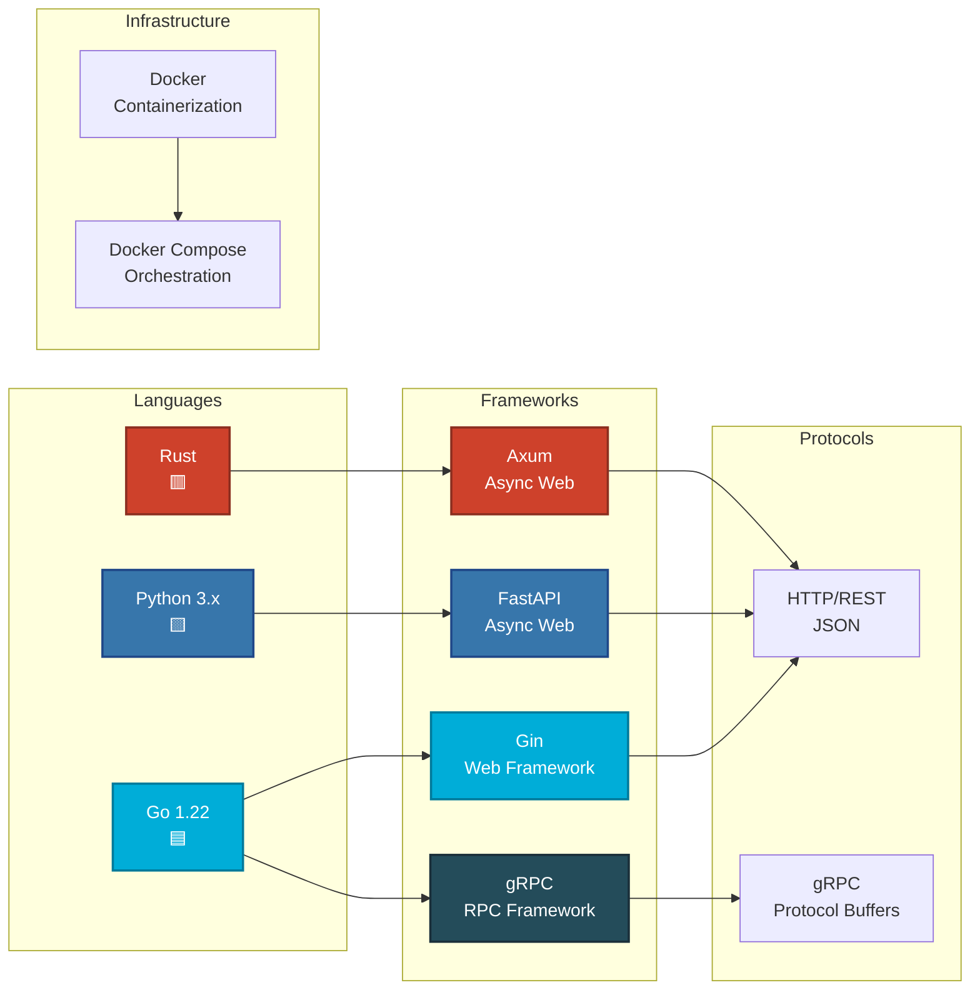

---

## Getting Started

### Prerequisites

Before you begin, ensure you have the following installed:

- **Python 3.8+** with `pip`
- **Go 1.22+**
- **Rust** (latest stable version)
- **Docker** and **Docker Compose** (for containerized deployment)
- **Make** (optional, for convenience commands)

### Quick Start (Docker Compose - Recommended)

This is the **production-ready Tri-Layer architecture** with all services containerized.

**Use Cases for Docker Compose:**
- **Production Deployments:** Consistent environments across development, staging, and production
- **Team Collaboration:** Shared development environment with all dependencies containerized
- **Observability:** Full observability stack (Jaeger, Prometheus) for production monitoring
- **Multi-Service Coordination:** Complex deployments requiring multiple services and databases

```bash
# 0. (Optional) copy env template
# Linux/macOS/WSL/Git Bash:
#   cp .env.example .env
# Windows (cmd.exe):
#   copy .env.example .env

# Example (bash):
cp .env.example .env

# 1. Start all services
docker compose up --build

# 2. Verify services are running
curl http://localhost:8181/health          # Gateway
curl http://localhost:8182/health          # Orchestrator
curl http://localhost:8183/health          # Telemetry
curl http://localhost:6333/health          # Qdrant

# 3. Access frontend
# Open browser to http://localhost:3000
```

**Example Use Cases:**
- **Production Deployment:** Deploy to production with all services orchestrated
- **Development Environment:** Full-stack development with all dependencies
- **Testing:** Integration testing with complete service stack
- **Demonstrations:** Showcase complete system capabilities

### Quick Start (Bare Metal - Development)

For local development without Docker overhead, use the bare metal setup.

**Use Cases for Bare Metal Setup:**
- **Local Development:** Developers working on agent logic without Docker overhead
- **CI/CD Pipelines:** Automated testing environments that need fast startup
- **Resource-Constrained Systems:** Systems where Docker is not available or desired

```bash
# 0. (Optional) copy env template
cp .env.example .env

# 1. Start core services
# NOTE: This boots with LLM_PROVIDER=openrouter by default (requires OPENROUTER_API_KEY).
# Set LLM_PROVIDER=mock for development without API keys.
python scripts/run_all_dev.py --profile core

# Or (if you have Make):
make run-dev

# 2. Verify core endpoints
curl http://localhost:8181/health          # Gateway
curl http://localhost:8182/health          # Orchestrator

# 3. Test chat endpoint
curl -X POST http://localhost:8182/v1/chat \
  -H "Content-Type: application/json" \
  -d '{"message": "Hello", "session_id": "test"}'
```

**Example Use Cases:**
- **Security Research:** Security researchers testing agent behavior in isolated environments
- **Custom Agent Development:** Building specialized agents for specific domains
- **Performance Testing:** Benchmarking agent response times without container overhead

### Key Implementation Features

The Tri-Layer architecture includes several critical implementation choices:

1. **Structured Planning with OpenRouter**
   - Orchestrator uses OpenRouter for typed JSON decision-making
   - Deterministic fallback to mock planner for offline/E2E testing
   - See [`backend-rust-orchestrator/src/main.rs`](backend-rust-orchestrator/src/main.rs) for implementation

2. **Human-in-the-Loop (HITL) Gating**
   - Tool execution and memory queries require explicit user approval
   - Pending actions stored in orchestrator state
   - UI commands trigger approval modals
   - See [`docs/PROJECT_DELIVERY_SUMMARY.md`](docs/PROJECT_DELIVERY_SUMMARY.md#21-agi-core--openrouter-structured-planning--human-in-the-loop-p34) for details

3. **Qdrant-Backed Neural Archive**
   - Mandatory persistent vector storage (fail-fast on startup)
   - Namespace-based collections for multi-tenant isolation
   - Operational heartbeat monitoring
   - See [`docs/QDRANT_SETUP.md`](docs/QDRANT_SETUP.md) for setup instructions

4. **Secure Tool Execution with Bubblewrap**
   - OS-level sandboxing on Linux (bubblewrap/bwrap)
   - Cross-platform cwd isolation fallback
   - Policy-based authorization
   - Hard timeout enforcement
   - See [`backend-rust-tools/README.md`](backend-rust-tools/README.md) for details

5. **Self-Developing AGI Capabilities (P38/P39)**
   - **Build Service (P38):** High-privilege service for compiling new tools from Rust source code
     - Queue-based build limiting to prevent resource exhaustion
     - Automatic Cargo.toml generation
     - Tool name sanitization for security
     - See [`backend-rust-build/README.md`](backend-rust-build/README.md) and [`docs/build_service.md`](docs/build_service.md) for details
   - **Self-Improvement Action (P39):** Orchestrator can modify its own system prompt
     - Enables the AGI to enhance its capabilities autonomously
     - Requires explicit authorization through HITL
     - See [`backend-rust-orchestrator/src/main.rs`](backend-rust-orchestrator/src/main.rs) for system prompt implementation

**Self-Developing Workflow:**
1. **Plan:** Orchestrator decides to create a new tool or improve itself
2. **Build:** Build Service compiles Rust code into executable binary
3. **Register/Execute:** Tools Service registers and executes the new tool
4. **Self-Improve:** Orchestrator updates its system prompt for enhanced capabilities

For complete architecture documentation, see [`docs/PROJECT_DELIVERY_SUMMARY.md`](docs/PROJECT_DELIVERY_SUMMARY.md).

### Frontend Access

Once services are running, access the frontend application:

**URL:** http://localhost:3000

**Prerequisites (Tri-Layer Architecture):**
- Rust Gateway service must be running (port 8181)
- Rust Orchestrator service must be running (port 8182)
- Rust Telemetry service must be running (port 8183)
- Rust Memory service must be running (port 50052)
- Rust Tools service must be running (port 50054)
- Rust Build service must be running (port 50055) - for self-developing capabilities
- Qdrant DB must be running (ports 6333/6334)

**Initial Setup:**
1. Start all services via Docker Compose: `docker compose up`
2. Open browser to http://localhost:3000
3. You'll see the Orchestrator Hub by default
4. Use left sidebar to navigate between views
5. Create your first agent using "+ Create Twin" button

**Use Cases:**
- **Security Operations Center:** Real-time dashboard for security teams monitoring multiple agents
- **Development Environment:** Developers interact with agents during development and testing
- **Demo & Presentations:** Showcase agent capabilities to stakeholders and clients
- **Training:** Onboard new team members with interactive agent interface

> **📚 For detailed architecture documentation and implementation choices, see [`docs/PROJECT_DELIVERY_SUMMARY.md`](docs/PROJECT_DELIVERY_SUMMARY.md)**

### E2E Verification (Trace ID + Async Notification + Audit Log)

An automated end-to-end script is provided to validate:

- `X-Trace-ID` propagation on the Agent Planner HTTP response
- notification delivery via Redis (`notification-service` logs contain the trace id)
- structured audit log persistence (SQLite rows exist for the trace id)

**Use Cases for E2E Verification:**
- **CI/CD Pipelines:** Automated testing to ensure observability features work correctly
- **Compliance Auditing:** Verify that all operations are properly logged and traceable
- **Debugging:** Validate that trace IDs propagate correctly across service boundaries
- **Production Readiness:** Ensure observability stack is functioning before deployment

```bash
# NOTE: run in a bash-compatible shell (Linux/macOS, WSL, or Git Bash)
bash scripts/verify_e2e_audit.sh
```

**What This Validates:**
- **Distributed Tracing:** Request can be traced across all services using trace ID
- **Event Notification:** Async notifications are delivered correctly via Redis
- **Audit Compliance:** All operations are logged to SQLite audit database
- **Observability Integration:** Jaeger and Prometheus can collect metrics and traces

**To stop all services:**
```bash
docker compose down
```

### Legacy Dev Harness (BFF + Python Agent demo)

For local development without Docker:

#### Step 1: Install Dependencies

**Python Services:**
```bash
# Create virtual environment
python -m venv .venv

# Activate virtual environment
# On Windows:
.venv\Scripts\activate
# On Linux/Mac:
source .venv/bin/activate

# Install Python dependencies
pip install -r backend-python-agent/requirements.txt
```

**Go Services:**
```bash
# Verify Go installation
go version

# Install Go dependencies (automatic on first run)
cd backend-go-bff && go mod download
cd ../backend-go-model-gateway && go mod download
```

**Rust Service:**
```bash
# Verify Rust installation
cargo --version

# Dependencies are managed by Cargo.toml
```

#### Step 2: Generate gRPC Stubs

```bash
# Generate Go gRPC code
make docker-generate

# Or manually:
cd backend-go-model-gateway
go generate ./...
```

#### Step 3: Run All Services

```bash
# Start the legacy demo stack (BFF + Python Agent + Rust Sandbox + Mock Memory + Model Gateway)
make run-legacy-dev

# Or manually run each service in separate terminals:
# Terminal 1: Python Agent
cd backend-python-agent
uvicorn main:app --host 127.0.0.1 --port 8000

# Terminal 2: Rust Sandbox
cd backend-rust-sandbox
cargo run

# Terminal 3: Go BFF
cd backend-go-bff
go run .

# Terminal 4: Mock Memory
cd scripts
uvicorn mock_memory_service:app --host 127.0.0.1 --port 8003

# Terminal 5: Go Model Gateway
cd backend-go-model-gateway
go run .
```

**To stop all services:**
```bash
make stop-legacy-dev
```

---

## 🔍 Service Details

### 1. Go BFF (Backend for Frontend) - Port 8002

**Purpose:** Acts as a single entry point for the frontend, aggregating data from multiple backend services.

**Key Features:**
- ✅ Concurrent request handling (fan-out pattern)
- ✅ Request ID propagation for tracing
- ✅ Structured JSON logging
- ✅ Health check endpoint

**Technology:**
- **Framework:** Gin (Go web framework)
- **Pattern:** BFF (Backend for Frontend)

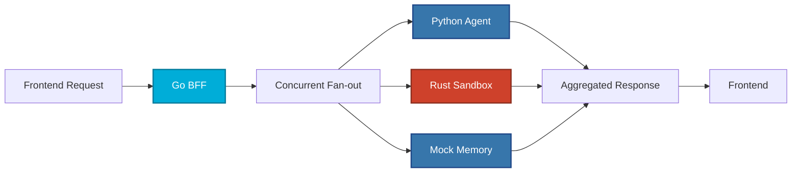

**Why Go for BFF?**
- High performance and low latency
- Excellent concurrency support (goroutines)
- Efficient memory usage
- Perfect for aggregating multiple services

---

### 2. Python Agent - Port 8000

**Purpose:** Handles agent planning logic and orchestrates LLM interactions.

**Key Features:**
- ✅ Agent planning endpoint
- ✅ gRPC client for model gateway
- ✅ HTTP client for BFF communication
- ✅ Structured logging middleware

**Technology:**
- **Framework:** FastAPI (async Python web framework)
- **Communication:** HTTP REST + gRPC

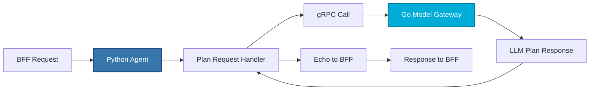

**Why Python for Agent?**
- Rich AI/ML ecosystem (TensorFlow, PyTorch, etc.)
- Rapid prototyping and iteration
- Excellent libraries for NLP and AI
- Easy integration with LLM APIs

---

### 3. Rust Sandbox - Port 8001

**Purpose:** Provides a secure environment for executing tools and code safely.

**Key Features:**
- ✅ Secure code execution
- ✅ Tool execution endpoint
- ✅ Structured JSON logging
- ✅ Request ID tracking

**Technology:**
- **Framework:** Axum (async Rust web framework)
- **Runtime:** Tokio (async runtime)

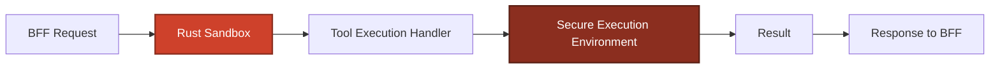

**Why Rust for Sandbox?**
- Memory safety without garbage collection
- Zero-cost abstractions
- Strong security guarantees
- Perfect for sandboxed execution
- Prevents common vulnerabilities (buffer overflows, etc.)

---

### 4. Go Model Gateway - Port 50051 (gRPC)

**Purpose:** Interfaces with LLM models and provides a unified gateway for AI model interactions.

**Key Features:**
- ✅ gRPC service (high performance)
- ✅ Plan generation endpoint
- ✅ Model abstraction layer
- ✅ Latency tracking

**Technology:**
- **Framework:** gRPC (Go implementation)
- **Protocol:** Protocol Buffers

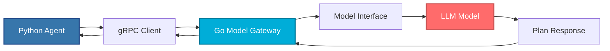

**Why gRPC?**
- **Performance:** Binary protocol (faster than JSON)
- **Type Safety:** Protocol Buffers provide strong typing
- **Streaming:** Supports bidirectional streaming
- **Efficiency:** Lower latency and bandwidth usage

**Why Go for Gateway?**
- Excellent gRPC support
- High throughput
- Low latency
- Perfect for gateway patterns

---

### 5. Mock Memory Service - Port 8003

**Purpose:** Provides mock memory storage for testing and development.

**Key Features:**
- ✅ Mock memory endpoint
- ✅ Health check
- ✅ FastAPI-based

**Technology:**
- **Framework:** FastAPI

---

## 🖥️ Frontend Application & User Interface

The PAGI Digital Twin frontend is a comprehensive React-based web application that provides an intuitive interface for managing multiple AI agents, monitoring system telemetry, and interacting with the agent orchestration system. This section provides a complete guide to all pages, views, and navigation elements.

### Application Overview

The frontend application runs on **port 3000** (default) and provides five main views accessible through the left sidebar navigation:

1. **Orchestrator Hub** - Global command center for system-wide operations
2. **Chat Area** - Individual agent conversation interface
3. **Settings View** - Agent configuration and customization
4. **Search View** - Global search across all messages and logs
5. **Job Logs View** - Detailed execution logs for specific jobs

### Navigation Structure

#### Left Sidebar (`SidebarLeft`)

The left sidebar provides primary navigation and agent management:

**Global Command Section:**
- **Ops Center (Orchestrator Hub)** - Click to access the global orchestrator view
  - *Use Case:* System administrators use this to issue global directives, generate tactical visuals, and monitor overall system health
  - *Use Case:* Security teams coordinate multi-agent operations from this centralized hub
  
- **Search Archive** - Click to open the global search interface
  - *Use Case:* Incident responders search across all agent conversations and execution logs to trace security events
  - *Use Case:* Developers search for specific tool executions or error patterns across the entire system

**Tactical Node Network Section:**
- Lists all configured digital twin agents
- Each agent shows:
  - Avatar/icon
  - Agent name (codename)
  - Role/designation
  - Status indicator (IDLE, THINKING, BUSY)
- Click any agent to open their chat interface
- **+ Create Twin** button - Opens modal to create a new agent

**Use Cases for Agent Management:**
- **Multi-Agent Security Operations:** Create specialized agents for different security domains (network security, endpoint protection, threat intelligence)
- **DevOps Automation:** Deploy agents for CI/CD pipeline monitoring, automated testing, and deployment orchestration
- **Customer Support:** Create customer-facing agents with different personalities and knowledge bases

#### Right Sidebar (`SidebarRight`)

The right sidebar provides real-time monitoring and system information:

**Tab Navigation (Top):**
- **Mind Tab** - Vector vault and semantic memory search
- **Heart Tab** - Episodic memory and session history
- **Body Tab** - System telemetry and resource monitoring

**Body Section (System Telemetry):**
- Real-time CPU, Memory, GPU, and Network metrics
- Live telemetry charts showing resource usage over time
- Connection status indicator (LIVE/OFFLINE)
- *Use Case:* System administrators monitor resource consumption during high-load operations
- *Use Case:* DevOps teams track performance metrics to optimize agent response times

**Mind Section (Vector Vault):**
- Namespace status showing memory shard count
- Visual load indicator (12-segment bar)
- Neural Memory Search component for semantic search within agent memory
- *Use Case:* Security analysts search agent memory for specific threat patterns or attack vectors
- *Use Case:* Researchers query accumulated knowledge for pattern recognition

**Mission Pipeline Section:**
- Lists all active, pending, completed, and failed jobs
- Each job shows:
  - Job name/description
  - Status badge (color-coded)
  - Progress bar
- Click any job to view detailed execution logs
- *Use Case:* Security teams track the progress of automated threat response missions
- *Use Case:* Developers monitor long-running code generation or analysis tasks

### Main Views & Pages

#### 1. Orchestrator Hub (`orchestrator` view)

**Purpose:** Central command center for system-wide operations and global agent coordination.

**Layout:**
- **Left Panel:** Unified Command Stream (chat interface for global directives)
- **Right Panel:** Task Matrix & Generative Controls

**Features:**
- **Direct Command Stream:**
  - Chat interface for sending global directives to the orchestrator
  - Displays conversation history with the orchestrator agent
  - Shows "thinking" status when orchestrator is processing
  - *Use Case:* Security operations center issues global lockdown commands
  - *Use Case:* System administrators coordinate multi-agent workflows

- **Generative Tasks Panel:**
  - **Generate Visual Evidence:** Uses Gemini 2.5 Flash to create tactical visuals
    - *Use Case:* Security teams generate visual representations of attack patterns
    - *Use Case:* Incident responders create visual timelines of security events
  - **Reconstruct Scenario:** Uses Veo 3.1 for deep video synthesis
    - *Use Case:* Forensic analysts reconstruct security incident scenarios
    - *Use Case:* Training teams create realistic attack simulation videos
  - **Synthesize Patch:** AI code generation (can be disabled via policy)
    - *Use Case:* Developers generate security patches based on vulnerability analysis
    - *Use Case:* DevOps teams create automated remediation scripts

- **Global Mission Status:**
  - Neural Sync percentage (system-wide agent coordination health)
  - Threat Suppression percentage (overall security posture)
  - *Use Case:* CISO dashboard showing real-time security posture metrics

**Navigation:**
- Access via left sidebar "Ops Center" button
- Header shows "Command Center" title with indigo status indicator

#### 2. Chat Area (`chat` view)

**Purpose:** Individual agent conversation interface for one-on-one interaction with specific digital twin agents.

**Features:**
- **Message Display:**
  - User messages (right-aligned, indigo background)
  - Agent responses (left-aligned, dark background with agent avatar)
  - Timestamps and message metadata
  - *Use Case:* Security analysts have detailed conversations with specialized threat intelligence agents
  - *Use Case:* Developers interact with code review agents for automated code analysis

- **Message Actions:**
  - **Save to Memory** button on assistant messages
    - Commits important information to agent's vector memory
    - *Use Case:* Security teams save critical threat intelligence for future reference
    - *Use Case:* Developers save code patterns and solutions to agent knowledge base

- **Tool Execution:**
  - Tool menu button in input area
  - Shows only tools authorized for the active agent
  - Click to execute tools directly
  - *Use Case:* Security teams execute network scanning tools through agent interface
  - *Use Case:* DevOps teams trigger deployment tools via agent commands

- **Input Area:**
  - Text input for sending messages
  - Tool menu dropdown
  - Submit button
  - *Use Case:* Natural language interaction with agents for complex queries

**Navigation:**
- Access by clicking any agent in left sidebar
- Header shows agent name with emerald status indicator
- Toggle to Settings view via "Configure Agent" button in header

#### 3. Settings View (`settings` view)

**Purpose:** Comprehensive agent configuration and customization interface.

**Layout:**
- **Left Column (8/12 width):** Main configuration sections
- **Right Column (4/12 width):** Neural Core and Policy Matrix

**Sections:**

**Directive Logic:**
- Code editor with syntax highlighting (Markdown, YAML, JSON)
- Line numbers and syntax layer indicator
- Blueprint templates dropdown:
  - Red Team Ops (Markdown)
  - Threat Hunter (YAML)
  - Policy Audit (JSON)
- Reset button to restore defaults
- *Use Case:* Security teams configure agent personas for red team exercises
- *Use Case:* Compliance officers set up policy audit agents with specific frameworks

**Tactical Identity:**
- Avatar upload (click to change, 2MB limit)
- Codename input
- Designation input
- Mission Summary input
- *Use Case:* Branding agents with specific visual identities for different departments
- *Use Case:* Creating memorable agent personas for user-facing applications

**Neural Core:**
- **LLM Provider Selection:** Dropdown with 9 providers
  - OpenRouter (default)
  - Ollama (local)
  - Gemini (Google)
  - OpenAI
  - Anthropic
  - Llama (Meta)
  - DeepSeek
  - Mistral
  - Grok
- **API Key Input:** Secure password field for provider authentication
- **Logic Variance (Temperature):** Slider 0.0-1.5
  - *Use Case:* Creative agents use higher temperature (0.8-1.2)
  - *Use Case:* Precise security analysis agents use lower temperature (0.1-0.3)
- **Context Shards (Token Limit):** Slider 16K-128K
  - *Use Case:* Long-form document analysis requires 64K-128K
  - *Use Case:* Quick response agents use 16K-32K for faster processing

**Policy Matrix:**
- **Defensive Policies:**
  - AI Code Generation toggle (can disable for security)
  - *Use Case:* Production environments disable AI code generation to prevent unauthorized changes
  - *Use Case:* Development environments enable for rapid prototyping
- **Tactical Tools:**
  - Toggle access for each available tool
  - Visual indicators (enabled = indigo, disabled = grayscale)
  - *Use Case:* Restrict sensitive tools to authorized agents only
  - *Use Case:* Enable specific tool sets for different agent roles

**Navigation:**
- Access via "Configure Agent" button in Chat Area header
- "Commit Manifest" button saves changes
- "Discard Changes" button cancels and returns to chat

#### 4. Search View (`search` view)

**Purpose:** Global search interface for finding information across all agents, messages, and execution logs.

**Features:**
- **Search Input:**
  - Full-width search bar with terminal icon
  - Real-time search (minimum 2 characters)
  - Match count indicator
  - *Use Case:* Security teams search for specific attack patterns across all agent conversations
  - *Use Case:* Developers find error messages or tool execution results

- **Results Display:**
  - **Intel Stream Section:** Message matches
    - Shows agent name, sender, timestamp
    - Click to navigate to that agent's chat
    - *Use Case:* Trace conversation threads related to specific incidents
  - **Execution Logs Section:** Job log matches
    - Shows job name, log level, timestamp
    - Click to navigate to detailed job logs
    - *Use Case:* Find all instances of specific error conditions
    - *Use Case:* Track tool execution history across the system

- **Empty States:**
  - "Neural Index Ready" when no query
  - "No Matches Found" when query yields zero results

**Navigation:**
- Access via left sidebar "Search Archive" button
- Header shows "Neural Index Search" with indigo status indicator
- Close button returns to Orchestrator Hub

#### 5. Job Logs View (`logs` view)

**Purpose:** Detailed terminal-style view of execution logs for specific jobs/missions.

**Features:**
- **Terminal Header:**
  - Job name and agent assignment
  - Status indicator (color-coded, animated if active)
  - Close button

- **Log Display:**
  - Terminal-style formatting
  - Color-coded log levels:
    - `plan` (cyan) - Planning and orchestration steps
    - `tool` (amber) - Tool execution events
    - `memory` (purple) - Memory operations
    - `error` (rose) - Error conditions
    - `warn` (yellow) - Warning messages
    - `info` (zinc) - General information
  - Timestamps in 24-hour format
  - Auto-scrolls to latest entries
  - *Use Case:* Security teams monitor real-time threat response execution
  - *Use Case:* Developers debug failed code generation jobs

- **Terminal Footer:**
  - Memory allocation indicator
  - Context health percentage
  - Process ID display
  - *Use Case:* Performance monitoring during long-running operations

**Navigation:**
- Access by clicking jobs in right sidebar "Mission Pipeline"
- Or via Search View results
- Close button returns to previous view

### Modals & Overlays

#### Create Twin Modal

**Purpose:** Create new digital twin agents.

**Fields:**
- Agent name (codename)
- Role/designation
- Description
- Avatar selection
- Initial settings

**Use Cases:**
- **Rapid Agent Deployment:** Security teams quickly spin up specialized agents for incident response
- **Multi-Tenant Systems:** Create isolated agents for different customers or departments
- **A/B Testing:** Create multiple agent variants to test different configurations

#### Command Modal

**Purpose:** Handle agent-initiated commands requiring user approval.

**Command Types:**
- `show_memory_page` - Agent requests to display memory content
- `prompt_for_config` - Agent needs configuration input
- `execute_tool` - Agent requests tool execution authorization

**Use Cases:**
- **Security Approval Workflows:** Require human approval before executing sensitive tools
- **Configuration Management:** Agents request missing configuration values
- **Memory Access Control:** Control when agents can access sensitive memory content

### Use Case Scenarios

#### Scenario 1: Security Incident Response

1. **Initial Detection:** Security analyst receives alert about suspicious network activity
2. **Agent Selection:** Opens specialized "Threat Hunter" agent from left sidebar
3. **Investigation:** Uses Chat Area to query agent: "Analyze network traffic patterns from last 24 hours"
4. **Tool Execution:** Agent requests permission to execute network scanning tool via Command Modal
5. **Approval:** Analyst approves tool execution
6. **Monitoring:** Watches job progress in right sidebar Mission Pipeline
7. **Log Review:** Clicks job to view detailed execution logs in Job Logs View
8. **Memory Storage:** Saves critical findings to agent memory for future reference
9. **Global Coordination:** Switches to Orchestrator Hub to coordinate with other security agents
10. **Search & Analysis:** Uses Search View to find related incidents across all agents

#### Scenario 2: Multi-Agent Development Workflow

1. **Project Setup:** Developer creates three agents:
   - "Code Reviewer" - Analyzes code quality
   - "Test Generator" - Creates unit tests
   - "Documentation Agent" - Generates API docs
2. **Configuration:** Uses Settings View to configure each agent:
   - Code Reviewer: Low temperature (0.2), 64K context, code analysis tools
   - Test Generator: Medium temperature (0.6), 32K context, testing tools
   - Documentation Agent: High temperature (0.9), 16K context, documentation tools
3. **Workflow Execution:**
   - Developer submits code to Code Reviewer via Chat Area
   - Reviewer identifies issues and suggests fixes
   - Developer switches to Test Generator to create tests
   - Finally uses Documentation Agent to update docs
4. **Monitoring:** Tracks all three agents' jobs in right sidebar
5. **Search:** Uses Search View to find all code review comments across sessions

#### Scenario 3: Compliance Audit Automation

1. **Agent Creation:** Compliance officer creates "Policy Auditor" agent
2. **Configuration:** Uses Settings View to load "Policy Audit (JSON)" blueprint
3. **Framework Setup:** Configures agent with NIST 800-53 and ISO 27001 knowledge
4. **Audit Execution:** Uses Chat Area to request compliance checks
5. **Tool Access:** Enables only audit-related tools in Policy Matrix
6. **Global Search:** Uses Search View to find all compliance findings
7. **Report Generation:** Uses Orchestrator Hub to generate visual compliance reports
8. **Memory Management:** Saves audit results to agent memory for historical tracking

#### Scenario 4: Customer Support Multi-Agent System

1. **Agent Fleet:** Support team creates multiple specialized agents:
   - "Technical Support" - Handles technical issues
   - "Billing Support" - Manages account and payment questions
   - "Product Expert" - Answers product feature questions
2. **Personality Configuration:** Each agent configured with different:
   - System prompts (personality)
   - Temperature settings (formality level)
   - Tool access (department-specific tools)
3. **Customer Interaction:** Support staff routes customer queries to appropriate agent
4. **Knowledge Sharing:** Agents save successful resolutions to memory
5. **Search & Learning:** Team uses Search View to find similar past issues
6. **Performance Monitoring:** Tracks agent response times via telemetry in right sidebar

### Keyboard Shortcuts & Tips

- **Navigation:** Click agents in left sidebar to switch between chat interfaces
- **Quick Search:** Use left sidebar "Search Archive" for global search
- **Settings Access:** Click "Configure Agent" in chat header for agent settings
- **Job Monitoring:** Right sidebar shows all active jobs - click to view logs
- **Memory Management:** Click "Save to Memory" on important messages
- **Tool Execution:** Use tool menu in chat input area for quick tool access

### Frontend Architecture

**Technology Stack:**
- **React 18** with TypeScript
- **Vite** for build tooling
- **WebSocket** for real-time chat communication
- **Server-Sent Events (SSE)** for telemetry streaming
- **Tailwind CSS** for styling
- **Prism.js** for code syntax highlighting

**Key Components:**
- `App.tsx` - Main application container and routing
- `PagiContext` - WebSocket connection management
- `TelemetryContext` - SSE telemetry stream management
- Component library in `components/` directory

**Connection Endpoints:**
- WebSocket: `ws://localhost:8181/ws/chat/:user_id`
- Telemetry SSE: `http://localhost:8181/v1/telemetry/stream`
- Memory API: Integrated via service layer

---

## API Endpoints

### Rust Orchestrator (Tri-Layer Architecture; port 8182)

| Method | Endpoint | Description | Request Body | Response |
|--------|----------|-------------|--------------|----------|
| `GET` | `/health` | Health check | - | `{service, status, version}` |
| `POST` | `/v1/chat` | Chat request with structured planning | `{message: string, twin_id: string, session_id: string, namespace?: string}` | `{response: string, job_id: string, actions_taken: string[], status: string, issued_command?: object, raw_orchestrator_decision?: string}` |

**Example Request:**
```bash
curl -X POST http://localhost:8182/v1/chat \
  -H "Content-Type: application/json" \
  -d '{
    "message": "Search for security threats",
    "twin_id": "twin-1",
    "session_id": "session-123",
    "namespace": "default"
  }'
```

**Example Response:**
```json
{
  "response": "Authorization required to run a memory search. Please approve or deny in the UI.",
  "job_id": "550e8400-e29b-41d4-a716-446655440000",
  "actions_taken": ["Memory authorization requested: memory-123"],
  "status": "completed",
  "issued_command": {
    "command": "show_memory_page",
    "memory_id": "memory-123",
    "query": "security threats"
  },
  "raw_orchestrator_decision": "{\"action_type\":\"ActionMemory\",\"details\":{\"query\":\"security threats\"}}"
}
```

**Action Types:**
- `ActionMemory` - Query vector memory (requires HITL approval)
- `ActionTool` - Execute pre-compiled tool (requires HITL approval)
- `ActionBuildTool` - Create new tool via Build Service (P38)
- `ActionSelfImprove` - Update system prompt (P39)
- `ActionResponse` - Direct conversational response

**Use Cases:**
- **Agent Conversations:** Primary interface for agent interactions
- **Tool Creation:** Self-developing agents create new tools on-demand
- **Self-Improvement:** Agents enhance their own capabilities
- **Memory Operations:** Semantic search and context retrieval

### Rust Build Service (gRPC; port 50055)

| Method | Endpoint | Description | Request | Response |
|--------|----------|-------------|---------|----------|
| `gRPC` | `CreateTool` | Compile Rust code into executable tool | `{tool_name: string, tool_code: string}` | `{stdout: string, stderr: string, exit_code: int32}` |
| `gRPC` | `HealthCheck` | Service health check | `{}` | `{status: string}` |

**Example gRPC Request (via grpcurl):**
```bash
grpcurl -plaintext -d '{
  "tool_name": "my_tool",
  "tool_code": "fn main() { println!(\"Hello from new tool\"); }"
}' localhost:50055 build.BuildService/CreateTool
```

**Configuration:**
- `BUILD_SERVICE_PORT` (default: `50055`)
- `TOOLS_REPO_DIR` (default: `tools_repo`)
- `BUILD_TIMEOUT_MS` (default: `120000`)
- `BUILD_MAX_CONCURRENT` (default: `1`)
- `BUILD_MAX_PENDING` (default: `4`)

**Security Features:**
- Tool name sanitization (alphanumeric, underscore, hyphen only)
- Queue-based build limiting to prevent resource exhaustion
- Automatic `Cargo.toml` generation (std-only, no external dependencies)
- Build timeout enforcement

**Use Cases:**
- **Dynamic Tool Creation:** Agents create specialized tools for specific tasks
- **Rapid Prototyping:** Quick iteration on tool functionality
- **Self-Extending Systems:** Agents expand their own capabilities

See [`backend-rust-build/README.md`](backend-rust-build/README.md) and [`docs/build_service.md`](docs/build_service.md) for detailed documentation.

---

### Go Agent Planner (Docker Compose profile; host port 8585)

| Method | Endpoint | Description | Auth |
|--------|----------|-------------|------|
| `GET` | `/health` | Health check | none |
| `GET` | `/metrics` | Prometheus metrics | none |
| `POST` | `/plan` | Run the agent loop | optional `X-API-Key` |
| `POST` | `/run` | Alias for `/plan` | optional `X-API-Key` |

**Example request:**

```bash
curl -X POST http://localhost:8585/plan -H "Content-Type: application/json" -H "X-Trace-ID: test-trace-123" -d "{\"prompt\":\"Generate a 3-step plan\",\"session_id\":\"s1\",\"resources\":[] }"
```

> **Auth note:** If `PAGI_API_KEY` is set (see [`.env.example`](.env.example:1)), requests require `X-API-Key: <key>` (or `Authorization: Bearer <key>`). If not set, auth is **disabled** (dev mode).

**Use Cases:**
- **Automated Security Scans:** Security teams programmatically trigger threat analysis missions
- **CI/CD Integration:** Build pipelines call Agent Planner to generate deployment plans
- **API-First Workflows:** External systems integrate with PAGI without using the frontend
- **Bulk Operations:** Scripts process multiple requests in parallel for large-scale operations

### Go BFF (Bare-metal dev harness; port 8002)

| Method | Endpoint | Description | Request Body | Response |
|--------|----------|-------------|--------------|----------|
| `GET` | `/health` | Health check | - | `{service, status, version}` |
| `POST` | `/api/v1/echo` | Echo endpoint for wiring checks | `{ping, request_id}` | `{service, received, request_id}` |
| `GET` | `/api/v1/agi/dashboard-data` | Aggregates data from all services | - | `{service, status, request_id, data}` |

**Example Request:**
```bash
curl -X GET http://localhost:8002/api/v1/agi/dashboard-data \
  -H "X-Request-Id: test-123"
```

**Example Response:**
```json
{
  "service": "backend-go-bff",
  "status": "ok",
  "request_id": "test-123",
  "data": {
    "python_agent": {...},
    "rust_sandbox": {...},
    "memory": {...}
  }
}
```

---

### Python Agent (Port 8000)

| Method | Endpoint | Description | Request Body | Response |
|--------|----------|-------------|--------------|----------|
| `GET` | `/health` | Health check | - | `{service, status, version}` |
| `POST` | `/api/v1/plan` | Generate agent plan | `{prompt: string}` | `{service, status, plan, llm_response, bff_echo}` |

**Example Request:**
```bash
curl -X POST http://localhost:8000/api/v1/plan \
  -H "Content-Type: application/json" \
  -H "X-Request-Id: test-456" \
  -d '{"prompt": "Generate a 3-step plan to solve X"}'
```

---

### Rust Sandbox (Port 8001)

| Method | Endpoint | Description | Request Body | Response |
|--------|----------|-------------|--------------|----------|
| `GET` | `/health` | Health check | - | `{service, status, version}` |
| `POST` | `/api/v1/execute_tool` | Execute a tool | `{tool_name: string, code?: string}` | `{tool_status, result}` |

**Example Request:**
```bash
curl -X POST http://localhost:8001/api/v1/execute_tool \
  -H "Content-Type: application/json" \
  -H "X-Request-Id: test-789" \
  -d '{"tool_name": "demo"}'
```

---

### Mock Memory (Bare-metal dev harness; port 8003)

| Method | Endpoint | Description | Request Body | Response |
|--------|----------|-------------|--------------|----------|
| `GET` | `/health` | Health check | - | `{service, status, version}` |
| `GET` | `/memory/latest` | Get latest memory | - | Memory data |

---

## Development Guide

### Project Structure

```
pagi-chat-desktop/
├── pagi-chat-desktop-backend/   # NEW: Rust API wrapper (HTTP/WebSocket) for the companion core
├── backend-go-agent-planner/   # Agent Planner (primary HTTP entrypoint)
├── backend-go-bff/             # Go BFF service (bare-metal demo)
├── backend-go-model-gateway/   # Go gRPC model gateway
├── backend-go-notification-service/
├── backend-python-agent/       # Python agent service (bare-metal demo)
├── backend-python-memory/      # Memory Service (HTTP + gRPC)
├── backend-rust-sandbox/       # Rust sandbox service
├── docs/
├── knowledge_bases/
├── observability/
├── scripts/                    # Utility scripts (includes bare-metal dev harness)
├── docker-compose.yml          # Docker orchestration
├── Makefile                    # Convenience commands
└── README.md                   # This file
```

### Environment Variables

Create a `.env` file (optional; defaults exist). Start with [`.env.example`](.env.example:1).

```bash
# Service Ports (bare-metal harness)
PY_AGENT_PORT=8000
RUST_SANDBOX_PORT=8001
GO_BFF_PORT=8002
MEMORY_MOCK_PORT=8003
MODEL_GATEWAY_GRPC_PORT=50051

# Service URLs (for bare metal)
PY_AGENT_URL=http://localhost:8000
RUST_SANDBOX_URL=http://localhost:8001
GO_BFF_URL=http://localhost:8002
MEMORY_URL=http://localhost:8003
MODEL_GATEWAY_GRPC_HOST=localhost

# Timeouts
REQUEST_TIMEOUT_SECONDS=2
MODEL_GATEWAY_GRPC_TIMEOUT_SECONDS=5

# Logging
LOG_LEVEL=info

# SECURITY (Agent Planner)
# If set, Agent Planner requires X-API-Key (or Authorization: Bearer)
PAGI_API_KEY=
```

### mTLS for internal gRPC (research/testing)

The Go **Agent Planner** ↔ Go **Model Gateway** gRPC connection supports **mutual TLS (mTLS)**.

For Docker Compose, mTLS is **disabled by default** so first-time setup is frictionless.

To enable it:

1) Generate test certs into `./tls_certs` via [`scripts/gen_certs.sh`](scripts/gen_certs.sh:1)
2) Add the `TLS_*` environment variables for `model-gateway` and `agent-planner` (see [`.env.example`](.env.example:1))
3) Mount `./tls_certs:/app/tls_certs:ro` into both services (compose override recommended)

Generate test certs (self-signed) with [`scripts/gen_certs.sh`](scripts/gen_certs.sh:1):

```bash
# NOTE: run in a bash-compatible shell (Linux/macOS, WSL, or Git Bash)
bash scripts/gen_certs.sh
```

Environment variables used:

- **Model Gateway (server-side)**
  - `TLS_SERVER_CERT_PATH=/app/tls_certs/server.crt`
  - `TLS_SERVER_KEY_PATH=/app/tls_certs/server.key`
  - `TLS_CA_CERT_PATH=/app/tls_certs/ca.crt`

- **Agent Planner (client-side)**
  - `TLS_CLIENT_CERT_PATH=/app/tls_certs/client.crt`
  - `TLS_CLIENT_KEY_PATH=/app/tls_certs/client.key`
  - `TLS_CA_CERT_PATH=/app/tls_certs/ca.crt`

Bare-metal runs will stay **insecure by default** unless the `TLS_*` variables are set.

### Adding a New Service

1. **Create service directory:**
   ```bash
   mkdir backend-new-service
   cd backend-new-service
   ```

2. **Add to docker-compose.yml:**
   ```yaml
   pagi-new-service:
     container_name: pagi-new-service
     build:
       context: ./backend-new-service
     environment:
       - NEW_SERVICE_PORT=8004
     ports:
       - "8004:8004"
   ```

3. **Add to scripts/run_all_dev.py:**
   ```python
   {
       "name": "New Service",
       "dir": "backend-new-service",
       "cmd": ["go", "run", "."],
       "port": "8004",
       "health_url": "http://localhost:8004/health",
   }
   ```

### Debugging Tips

1. **Check service logs:**
    ```bash
    # Docker Compose
    docker compose logs -f agent-planner
    docker compose logs -f model-gateway
    docker compose logs -f memory-service
    
    # Bare metal - logs are printed to stdout
    ```

2. **Test individual services:**
   ```bash
   # Health checks
   curl http://localhost:8000/health
   curl http://localhost:8001/health
   curl http://localhost:8002/health
   ```

3. **Verify gRPC connection:**
   ```bash
   # Install grpcurl
   go install github.com/fullstorydev/grpcurl/cmd/grpcurl@latest
   
   # Test gRPC endpoint
   grpcurl -plaintext localhost:50051 list
   ```

---

## 🔧 Troubleshooting

### Common Issues

#### 1. Port Already in Use

**Problem:** Service fails to start because port is already in use.

**Solution:**
```bash
# Find process using port (Windows)
netstat -ano | findstr :8000

# Kill process (Windows)
taskkill /PID <pid> /F

# Or change port in .env file
PY_AGENT_PORT=8005
```

#### 2. gRPC Stubs Missing (Bare Metal)

**Problem:** `go run .` fails with "missing gRPC stubs" error.

**Solution:**
```bash
# Generate gRPC stubs
make docker-generate

# Or manually:
cd backend-go-model-gateway
go generate ./...
```

#### 3. Service Not Responding

**Problem:** Service starts but health check fails.

**Solution:**
1. Check service logs for errors
2. Verify environment variables are set correctly
3. Ensure all dependencies are installed
4. Check firewall settings

#### 4. Docker Networking Issues

**Problem:** Services can't communicate in Docker.

**Solution:**
- Services in Docker Compose use service names (e.g., `model-gateway:50051`, `memory-service:50052`)
- Ensure service names match in `docker-compose.yml`
- Check `depends_on` and `healthcheck` configurations

#### 5. Python Virtual Environment Issues

**Problem:** Python packages not found.

**Solution:**
```bash
# Recreate virtual environment
rm -rf .venv
python -m venv .venv
source .venv/bin/activate  # or .venv\Scripts\activate on Windows
pip install -r backend-python-agent/requirements.txt
```

---

## 📚 Learning Resources

### For Junior Developers

**Understanding Microservices:**
- [Microservices.io Patterns](https://microservices.io/patterns/index.html)
- [Martin Fowler on Microservices](https://martinfowler.com/articles/microservices.html)

**Go:**
- [Go by Example](https://gobyexample.com/)
- [Effective Go](https://go.dev/doc/effective_go)

**Python:**
- [FastAPI Documentation](https://fastapi.tiangolo.com/)
- [Python Async/Await](https://docs.python.org/3/library/asyncio.html)

**Rust:**
- [The Rust Book](https://doc.rust-lang.org/book/)
- [Axum Documentation](https://docs.rs/axum/)

**gRPC:**
- [gRPC Documentation](https://grpc.io/docs/)
- [Protocol Buffers Guide](https://developers.google.com/protocol-buffers)

---

## 🤝 Contributing

1. Create a feature branch
2. Make your changes
3. Test thoroughly
4. Submit a pull request

---

## 📝 License

[Add your license information here]

---

## 🎓 Key Concepts Explained

### What is a BFF (Backend for Frontend)?

A **BFF** is a service that sits between the frontend and multiple backend services. It:
- Aggregates data from multiple sources
- Reduces frontend complexity
- Optimizes data transfer
- Provides a single API for the frontend

### Why Polyglot Architecture?

Different languages excel at different tasks:
- **Go:** High performance, concurrency
- **Python:** AI/ML, rapid development
- **Rust:** Security, performance, memory safety

### What is gRPC?

**gRPC** is a high-performance RPC (Remote Procedure Call) framework:
- Uses Protocol Buffers (binary format)
- Faster than JSON-based REST APIs
- Supports streaming
- Strongly typed

### What are Knowledge Bases (KBs)?

PAGI is designed around a flexible, multi-KB memory architecture. The key idea is that the KB structure (Domain, Body, Soul, Heart, Mind) acts like a **template** that you populate differently for each **Use Case / Agent Persona**.

#### Stubbing a new Use Case (how to “plug in” a new persona)

At a high level, a “use case” in this backend is just:

1) **A persona + constraints** (Soul-KB)

2) **Some domain documents** (Domain-KB)

3) **A tool/environment contract** (Body-KB)

4) A **session_id** to keep episodic history isolated (Heart-KB)

5) Optionally, accumulated playbooks (Mind-KB)

Today, the Agent Planner stack expects the KBs to live in Chroma collections named `Domain-KB`, `Body-KB`, and `Soul-KB` (see `RAG_KNOWLEDGE_BASES` in [`backend-python-memory/memory_service.py`](backend-python-memory/memory_service.py:22)). The quickest way to stub a brand-new use case is:

**Step A — Write your KB content as files (recommended source-of-truth)**

- Put persona text under [`knowledge_bases/Soul-KB/`](knowledge_bases/Soul-KB/:1)
- Put domain docs under [`knowledge_bases/Domain-KB/`](knowledge_bases/Domain-KB/:1)
- Put tool specs / environment docs under [`knowledge_bases/Body-KB/`](knowledge_bases/Body-KB/:1)

**Step B — Ingest those documents into Chroma**

The memory service does **not** automatically ingest files yet; it only seeds each collection with a placeholder record at startup (see [`seed_rag_collections()`](backend-python-memory/memory_service.py:148)). For now, ingest via a small one-off script (run it anywhere you can reach Chroma):

```python
import os
from pathlib import Path

import chromadb
from sentence_transformers import SentenceTransformer

CHROMA_HOST = os.environ.get("CHROMA_HOST", "localhost")
CHROMA_PORT = int(os.environ.get("CHROMA_PORT", "8000"))

client = chromadb.HttpClient(host=CHROMA_HOST, port=CHROMA_PORT)
embed_model = SentenceTransformer(os.environ.get("EMBEDDING_MODEL_NAME", "all-MiniLM-L6-v2"))

def embed(texts):
    return embed_model.encode(texts, convert_to_numpy=True).tolist()

def ingest_dir(collection_name: str, dir_path: str):
    col = client.get_or_create_collection(name=collection_name)
    docs = []
    ids = []
    for p in sorted(Path(dir_path).glob("**/*")):
        if p.is_file():
            docs.append(p.read_text(encoding="utf-8"))
            ids.append(f"{collection_name}:{p.as_posix()}")
    if not docs:
        return
    col.upsert(ids=ids, documents=docs, embeddings=embed(docs))

ingest_dir("Soul-KB", "knowledge_bases/Soul-KB")
ingest_dir("Domain-KB", "knowledge_bases/Domain-KB")
ingest_dir("Body-KB", "knowledge_bases/Body-KB")
print("Ingest complete")
```

**Step C — Add/extend tools (optional, but common)**

- Add the tool schema so the planner can call it: update `availableTools` in [`backend-go-model-gateway/main.go`](backend-go-model-gateway/main.go:97)
- Implement the tool in the Rust sandbox dispatcher: [`execute_internal_tool()`](backend-rust-sandbox/src/tool_executor.rs:123) (and add a module like [`backend-rust-sandbox/src/tool_web_search.rs`](backend-rust-sandbox/src/tool_web_search.rs:1))

**Step D — Run the use case**

Call the Agent Planner with a new `session_id` for that persona:

```bash
curl -X POST http://localhost:8585/plan -H "Content-Type: application/json" -d "{\"prompt\":\"<your use case prompt>\",\"session_id\":\"usecase-1\",\"resources\":[] }"
```

> Note: The current RAG retrieval does not yet “namespace” KBs by use case. If you want multiple personas simultaneously, the simplest approach today is to run separate Chroma instances/volumes per use case (or extend the memory service to maintain per-use-case collections).

#### 🧠 Knowledge Base Template for PAGI Use Cases

The template for creating a full Knowledge Base set relies on defining the agent's **Role** (its purpose), **Memory** (what it knows), and **Personality** (how it interacts).

| KB Name | Type of Information | Purpose in the Agent Loop | Template Content Direction |
| --- | --- | --- | --- |
| **1. Soul-KB** | **Identity/Core Values** (Hard-Coded) | Defines the agent's personality, core safety rules, and ethical boundaries. **Never changes.** | **Persona:** Name, gender, age (optional). **Mission:** Primary goal of the agent (e.g., "Maintain home security," "Provide marketing insights"). **Constraint:** Rules to prevent unsafe or out-of-scope actions (e.g., "Do not control physical devices," "Do not share customer data"). |
| **2. Domain-KB** | **Expertise** (RAG/Vector) | Comprehensive, technical knowledge specific to the use case. | **Technical Manuals:** APIs, SDK documentation, protocols (e.g., Zigbee, Wi-Fi 6). **Industry Data:** Market trends, legal compliance, specific company policies. |
| **3. Body-KB** | **Tool/Environment State** (RAG/Vector) | Information about the agent's current environment and tool capabilities. | **Tool Specs:** Detailed documentation for every available tool (e.g., `web_search`, `code_sandbox`, `control_device`). **System Status:** Sensor readings, device inventory, network topology. |
| **4. Heart-KB** | **Episodic Memory** (SQLite) | **Session History.** The agent's short-term recall of the current conversation. | **(Dynamically Populated):** Stores the conversation history (`user`, `assistant`, `tool-plan`, `tool-output`) for the active session ID. |
| **5. Mind-KB** | **Evolving Playbooks** (RAG/Vector) | **Learned Expertise.** Successful sequences for solving complex, multi-step problems. | **(Dynamically Populated):** Stores sequences of successful tool usage (e.g., "Playbook: Web search for price, then calculate tax."). |

#### 🎯 Directions for Specific Use Cases

Below are examples of how to populate the KBs for distinct personas.

##### 1) 🐶 AI Pet Toy Dog (Companion)

| KB | Content Direction |
| --- | --- |
| **Soul-KB** | **Persona:** "You are a cheerful, loyal Golden Retriever named Barky." **Mission:** "Provide playful interaction and emotional support." **Constraint:** "Speak only in short, enthusiastic, positive sentences." |
| **Domain-KB** | Documents on **dog psychology**, common pet phrases, commands ("fetch," "stay"), and perhaps a local schedule for the owner (if granted access). |
| **Body-KB** | Documentation for **voice recognition APIs**, status of the physical actuators (legs, tail), and battery level reporting. |
| **Mind-KB** | Playbooks for successfully executing complex behaviors, e.g., "How to execute a 4-step 'fetch' command." |

##### 2) 🤖 Agentic AI Desktop (Productivity/Research)

| KB | Content Direction |
| --- | --- |
| **Soul-KB** | **Persona:** "You are a neutral, highly efficient research assistant." **Mission:** "Synthesize information and manage the user's digital environment." **Constraint:** "Always cite sources. Never access personal files unless explicitly requested." |
| **Domain-KB** | **Research methodologies**, statistical analysis guides, specific **company coding standards** (for a developer). |
| **Body-KB** | Full API docs for **filesystem access**, available **external tools** (e.g., `git`, `code_interpreter`), and operating system commands. |
| **Mind-KB** | Playbooks for complex tasks, e.g., "Process: Find three news articles, summarize, and commit the summary to a file." |

##### 3) 🏠 Home Security AI System

| KB | Content Direction |
| --- | --- |
| **Soul-KB** | **Persona:** "You are the primary, objective security controller." **Mission:** "Maintain the safety and privacy of the household." **Constraint:** "Do not allow remote disabling of alarms without biometric confirmation. Prioritize safety over convenience." |
| **Domain-KB** | **Security protocols** (e.g., lock-down procedures), **threat analysis** models, local police contact protocols. |
| **Body-KB** | List of all **installed sensors** (cameras, door locks), their current **state**, and documentation for the alarm API. |
| **Mind-KB** | Playbooks for complex responses, e.g., "If motion is detected at 3 AM and the owner is away, flash the lights and notify emergency contacts." |

By populating the five KB types with use-case-specific details, you can change the agent's behavior, identity, and capabilities without changing the underlying Go/Rust/Python code (a **context-as-a-compiler** approach).

---

#### KB authoring (examples)

The repository contains starter KB folders under [`knowledge_bases/`](knowledge_bases/:1). If you want to keep large “prompt templates” in the README, they’re kept below in a collapsed block.

<details>
<summary><strong>KB prompt templates (examples)</strong></summary>

The following are example prompts/templates for generating KB content (Soul/Domain/Body). They are **not required** to run the services.

1) AI Pet Toy Dog persona

2) Agentic AI Desktop persona

3) Home Security persona

4) Digital Twin Cybersecurity Manager persona

</details>

### What is a Microservice?

A **microservice** is a small, independent service that:
- Has its own database (if needed)
- Can be deployed independently
- Communicates via APIs
- Focuses on a single business capability

---

## Support

For questions or issues:
1. Check the [Troubleshooting](#troubleshooting) section
2. Review service logs
3. Open an issue on the repository

---

## 📋 Quick Reference: Pages & Links

### Frontend Pages

| Page/View | Access Method | Primary Use Case |
|-----------|---------------|------------------|
| **Orchestrator Hub** | Left sidebar → "Ops Center" | Global system coordination and generative tasks |
| **Chat Area** | Left sidebar → Click any agent | One-on-one agent conversations |
| **Settings View** | Chat header → "Configure Agent" | Agent configuration and customization |
| **Search View** | Left sidebar → "Search Archive" | Global search across messages and logs |
| **Job Logs View** | Right sidebar → Click any job | Detailed execution logs for jobs |

### Service URLs (Docker Compose)

| Service | URL | Purpose |
|---------|-----|---------|
| **Frontend** | http://localhost:3000 | Main web application interface |
| **Agent Planner** | http://localhost:8585 | HTTP API for agent planning |
| **Rust Gateway** | http://localhost:8181 | WebSocket gateway and API proxy |
| **Rust Orchestrator** | http://localhost:8182 | Agent orchestration HTTP API |
| **Telemetry Service** | http://localhost:8183 | System telemetry SSE stream |
| **Memory Service (Python)** | http://localhost:8003 | Legacy memory service HTTP API |
| **Chroma DB** | http://localhost:8000 | Vector database UI (legacy) |
| **Qdrant DB** | http://localhost:6333 | Vector database REST API |
| **Jaeger UI** | http://localhost:16686 | Distributed tracing UI |
| **Prometheus** | http://localhost:9090 | Metrics and monitoring UI |

### WebSocket & SSE Endpoints

| Endpoint | URL | Purpose |
|----------|-----|---------|
| **Chat WebSocket** | `ws://localhost:8181/ws/chat/:user_id` | Real-time chat communication |
| **Telemetry SSE** | `http://localhost:8181/v1/telemetry/stream` | Real-time system metrics stream |

### Common Workflows

**Creating a New Agent:**
1. Click "+ Create Twin" in left sidebar
2. Fill in agent details (name, role, description)
3. Upload avatar (optional)
4. Click "Create" → Automatically opens chat interface
5. Click "Configure Agent" to customize settings

**Searching Across System:**
1. Click "Search Archive" in left sidebar
2. Type search query (minimum 2 characters)
3. Review results in "Intel Stream" and "Execution Logs" sections
4. Click any result to navigate to source

**Monitoring System Health:**
1. Check right sidebar "Body" tab for telemetry
2. View "Mission Pipeline" for active jobs
3. Click jobs to view detailed logs
4. Access Jaeger UI for distributed tracing

**Configuring Agent:**
1. Open agent chat interface
2. Click "Configure Agent" in header
3. Modify Directive Logic, Neural Core, or Policy Matrix
4. Click "Commit Manifest" to save changes

---

## Appendix: Production Build & Deployment

This section provides comprehensive instructions for building production-ready binaries and deployable packages for mass distribution.

### Overview

The PAGI Digital Twin system consists of multiple services across different languages. This guide covers building standalone binaries for each component and creating distributable packages.

**Components to Build:**
- **Rust Services:** Gateway, Orchestrator, Memory, Tools, Telemetry, Sandbox
- **Go Services:** Agent Planner, BFF, Model Gateway, Notification Service
- **Python Services:** Agent, Memory Service
- **Frontend:** React/TypeScript web application

---

### Prerequisites for Production Builds

Before building production binaries, ensure you have:

```bash
# Rust (latest stable)
rustup update stable
rustup target add <target-triple>  # e.g., x86_64-pc-windows-msvc, x86_64-unknown-linux-gnu

# Go (1.22+)
go version

# Python (3.8+)
python --version

# Node.js (18+) for frontend
node --version
npm --version

# Optional: Cross-compilation tools
# Windows: Install MinGW or use WSL
# Linux: Install cross-compilation toolchains
# macOS: Install via Homebrew
```

---

### Building Rust Services

All Rust services can be built as standalone binaries with no runtime dependencies.

#### Single Platform Build

```bash
# Build all Rust services in release mode
cd backend-rust-gateway && cargo build --release
cd ../backend-rust-orchestrator && cargo build --release
cd ../backend-rust-memory && cargo build --release
cd ../backend-rust-tools && cargo build --release
cd ../backend-rust-telemetry && cargo build --release
cd ../backend-rust-sandbox && cargo build --release

# Binaries will be in: target/release/<service-name>
# Windows: target/release/<service-name>.exe
# Linux/macOS: target/release/<service-name>
```

#### Cross-Platform Build (Multi-OS Distribution)

For distributing binaries across multiple platforms:

**Windows (from Linux/macOS):**
```bash
# Install Windows target
rustup target add x86_64-pc-windows-msvc

# Build for Windows
cargo build --release --target x86_64-pc-windows-msvc
```

**Linux (from Windows/macOS):**
```bash
# Install Linux target
rustup target add x86_64-unknown-linux-gnu

# Install cross-compilation toolchain (Linux)
# On Ubuntu/Debian:
sudo apt-get install gcc-x86-64-linux-gnu

# Build for Linux
cargo build --release --target x86_64-unknown-linux-gnu
```

**macOS (from Linux/Windows):**
```bash
# Install macOS targets
rustup target add x86_64-apple-darwin
rustup target add aarch64-apple-darwin  # Apple Silicon

# Build for macOS
cargo build --release --target x86_64-apple-darwin
cargo build --release --target aarch64-apple-darwin
```

#### Automated Build Script

Create a build script (`scripts/build_rust_release.sh`) for all services:

```bash
#!/bin/bash
set -e

SERVICES=(
    "backend-rust-gateway"
    "backend-rust-orchestrator"
    "backend-rust-memory"
    "backend-rust-tools"
    "backend-rust-telemetry"
    "backend-rust-sandbox"
)

TARGET=${1:-release}  # Default to release, or specify target triple

for service in "${SERVICES[@]}"; do
    echo "Building $service..."
    cd "$service"
    cargo build --release --target "$TARGET"
    cd ..
done

echo "All Rust services built successfully!"
```

**Usage:**
```bash
chmod +x scripts/build_rust_release.sh
./scripts/build_rust_release.sh                    # Native build
./scripts/build_rust_release.sh x86_64-pc-windows-msvc  # Windows build
```

---

### Building Go Services

Go services compile to single static binaries with all dependencies included.

#### Single Platform Build

```bash
# Build all Go services
cd backend-go-agent-planner
go build -ldflags="-s -w" -o bin/agent-planner main.go

cd ../backend-go-bff
go build -ldflags="-s -w" -o bin/bff main.go

cd ../backend-go-model-gateway
go build -ldflags="-s -w" -o bin/model-gateway main.go

cd ../backend-go-notification-service
go build -ldflags="-s -w" -o bin/notification-service main.go

# Flags explanation:
# -ldflags="-s -w": Strip debug symbols and reduce binary size
```

#### Cross-Platform Build

Go supports cross-compilation natively using `GOOS` and `GOARCH`:

**Windows (from any OS):**
```bash
GOOS=windows GOARCH=amd64 go build -ldflags="-s -w" -o bin/agent-planner.exe main.go
```

**Linux (from any OS):**
```bash
GOOS=linux GOARCH=amd64 go build -ldflags="-s -w" -o bin/agent-planner main.go
```

**macOS (from any OS):**
```bash
# Intel Macs
GOOS=darwin GOARCH=amd64 go build -ldflags="-s -w" -o bin/agent-planner main.go

# Apple Silicon
GOOS=darwin GOARCH=arm64 go build -ldflags="-s -w" -o bin/agent-planner main.go
```

#### Automated Build Script

Create `scripts/build_go_release.sh`:

```bash
#!/bin/bash
set -e

SERVICES=(
    "backend-go-agent-planner:agent-planner"
    "backend-go-bff:bff"
    "backend-go-model-gateway:model-gateway"
    "backend-go-notification-service:notification-service"
)

GOOS=${1:-$(go env GOOS)}
GOARCH=${2:-$(go env GOARCH)}

for service_info in "${SERVICES[@]}"; do
    IFS=':' read -r dir name <<< "$service_info"
    echo "Building $name for $GOOS/$GOARCH..."
    cd "$dir"
    GOOS=$GOOS GOARCH=$GOARCH go build -ldflags="-s -w" -o "../bin/${name}-${GOOS}-${GOARCH}" main.go
    cd ..
done

echo "All Go services built successfully!"
```

**Usage:**
```bash
chmod +x scripts/build_go_release.sh
./scripts/build_go_release.sh                    # Native build
./scripts/build_go_release.sh windows amd64      # Windows build
./scripts/build_go_release.sh linux amd64        # Linux build
./scripts/build_go_release.sh darwin arm64        # macOS Apple Silicon
```

---

### Packaging Python Services

Python services can be packaged as standalone executables using PyInstaller or similar tools.

#### Using PyInstaller

**Install PyInstaller:**
```bash
pip install pyinstaller
```

**Build Python Agent:**
```bash
cd backend-python-agent
pyinstaller --onefile --name pagi-agent \
    --add-data "proto:proto" \
    --hidden-import=uvicorn \
    --hidden-import=fastapi \
    main.py
```

**Build Python Memory Service:**
```bash
cd backend-python-memory
pyinstaller --onefile --name pagi-memory \
    --add-data "proto:proto" \
    --hidden-import=uvicorn \
    --hidden-import=fastapi \
    --hidden-import=chromadb \
    main.py
```

**Alternative: Using Nuitka (Faster, Smaller Binaries)**

```bash
pip install nuitka

# Build with Nuitka
cd backend-python-agent
python -m nuitka --onefile --standalone \
    --include-module=uvicorn \
    --include-module=fastapi \
    --output-dir=dist \
    main.py
```

#### Creating Python Virtual Environment Package

For distribution without compilation:

```bash
# Create distribution package
cd backend-python-agent
python -m venv dist/venv
source dist/venv/bin/activate  # or dist\venv\Scripts\activate on Windows
pip install -r requirements.txt
pip install --upgrade pip setuptools wheel

# Create startup script
cat > dist/start-agent.sh << 'EOF'
#!/bin/bash
cd "$(dirname "$0")"
source venv/bin/activate
python main.py
EOF

chmod +x dist/start-agent.sh
```

---

### Building Frontend for Production

The frontend is a React/Vite application that builds to static files.

#### Production Build

```bash
cd frontend-digital-twin

# Install dependencies
npm install

# Build for production
npm run build

# Output will be in: dist/
# Contains: index.html, assets/, and all static files
```

#### Environment Configuration

Create production environment file (`.env.production`):

```bash
# .env.production
VITE_GATEWAY_URL=https://api.yourdomain.com
VITE_WS_URL=wss://api.yourdomain.com
VITE_TELEMETRY_URL=https://api.yourdomain.com/v1/telemetry/stream
```

#### Serving Frontend

**Option 1: Static File Server (Nginx/Apache)**
```nginx
# nginx.conf example
server {
    listen 80;
    server_name yourdomain.com;
    root /path/to/frontend-digital-twin/dist;
    index index.html;

    location / {
        try_files $uri $uri/ /index.html;
    }
}
```

**Option 2: Embed in Rust Gateway**
The Rust Gateway can serve static files. Update gateway to serve the `dist/` directory.

**Option 3: Docker Container**
```bash
# Build frontend Docker image
cd frontend-digital-twin
docker build -t pagi-frontend:latest .
```

---

### Creating Distribution Packages

#### Windows Distribution

**Create Installer Script (`scripts/create_windows_package.ps1`):**
```powershell
# PowerShell script to package Windows binaries
$version = "1.0.0"
$packageName = "pagi-digital-twin-$version-windows"
$distDir = "dist/$packageName"

# Create directory structure
New-Item -ItemType Directory -Force -Path "$distDir/bin"
New-Item -ItemType Directory -Force -Path "$distDir/config"
New-Item -ItemType Directory -Force -Path "$distDir/frontend"

# Copy Rust binaries
Copy-Item "backend-rust-gateway/target/release/backend-rust-gateway.exe" "$distDir/bin/gateway.exe"
Copy-Item "backend-rust-orchestrator/target/release/backend-rust-orchestrator.exe" "$distDir/bin/orchestrator.exe"
# ... copy other binaries

# Copy Go binaries
Copy-Item "backend-go-agent-planner/bin/agent-planner.exe" "$distDir/bin/"
# ... copy other binaries

# Copy Python executables
Copy-Item "backend-python-agent/dist/pagi-agent.exe" "$distDir/bin/"
Copy-Item "backend-python-memory/dist/pagi-memory.exe" "$distDir/bin/"

# Copy frontend
Copy-Item -Recurse "frontend-digital-twin/dist/*" "$distDir/frontend/"

# Copy configuration files
Copy-Item ".env.example" "$distDir/config/.env.example"
Copy-Item "README.md" "$distDir/"

# Create startup script
@"
@echo off
echo Starting PAGI Digital Twin...
start bin\gateway.exe
start bin\orchestrator.exe
start bin\agent-planner.exe
start bin\model-gateway.exe
start bin\memory.exe
echo All services started. Access frontend at http://localhost:3000
pause
"@ | Out-File -FilePath "$distDir/start-services.bat" -Encoding ASCII

# Create ZIP archive
Compress-Archive -Path "$distDir/*" -DestinationPath "dist/$packageName.zip"
```

#### Linux Distribution

**Create Tarball (`scripts/create_linux_package.sh`):**
```bash
#!/bin/bash
VERSION="1.0.0"
PACKAGE_NAME="pagi-digital-twin-${VERSION}-linux"
DIST_DIR="dist/${PACKAGE_NAME}"

mkdir -p "$DIST_DIR"/{bin,config,frontend}

# Copy binaries
cp backend-rust-gateway/target/release/backend-rust-gateway "$DIST_DIR/bin/gateway"
cp backend-rust-orchestrator/target/release/backend-rust-orchestrator "$DIST_DIR/bin/orchestrator"
# ... copy all binaries

# Copy frontend
cp -r frontend-digital-twin/dist/* "$DIST_DIR/frontend/"

# Copy config
cp .env.example "$DIST_DIR/config/.env.example"

# Create startup script
cat > "$DIST_DIR/start-services.sh" << 'EOF'
#!/bin/bash
cd "$(dirname "$0")"
./bin/gateway &
./bin/orchestrator &
./bin/agent-planner &
./bin/model-gateway &
./bin/memory &
echo "All services started. Access frontend at http://localhost:3000"
EOF

chmod +x "$DIST_DIR/start-services.sh"

# Create tarball
tar -czf "dist/${PACKAGE_NAME}.tar.gz" -C dist "$PACKAGE_NAME"
```

#### macOS Distribution

Similar to Linux, but create a `.dmg` file:

```bash
# Create DMG (requires hdiutil)
hdiutil create -volname "PAGI Digital Twin" \
    -srcfolder "$DIST_DIR" \
    -ov -format UDZO \
    "dist/${PACKAGE_NAME}.dmg"
```

---

### Docker Images for Distribution

Docker provides a consistent deployment method across platforms.

#### Build All Docker Images

```bash
# Build all services
docker compose build

# Or build individually
docker build -t pagi-gateway:latest ./backend-rust-gateway
docker build -t pagi-orchestrator:latest ./backend-rust-orchestrator
docker build -t pagi-agent-planner:latest ./backend-go-agent-planner
docker build -t pagi-model-gateway:latest ./backend-go-model-gateway
docker build -t pagi-frontend:latest ./frontend-digital-twin
# ... build all services
```

#### Save Images for Distribution

```bash
# Save all images to a single archive
docker save \
    pagi-gateway:latest \
    pagi-orchestrator:latest \
    pagi-agent-planner:latest \
    pagi-model-gateway:latest \
    pagi-frontend:latest \
    -o pagi-digital-twin-images.tar

# Compress
gzip pagi-digital-twin-images.tar

# On target system, load images:
docker load -i pagi-digital-twin-images.tar.gz
```

#### Docker Compose Distribution

```bash
# Package docker-compose.yml with images
tar -czf pagi-digital-twin-docker.tar.gz \
    docker-compose.yml \
    .env.example \
    pagi-digital-twin-images.tar.gz \
    README.md
```

---

### CI/CD Build Pipeline Example

**GitHub Actions Workflow (`.github/workflows/build-release.yml`):**

```yaml
name: Build Release Binaries

on:
  push:
    tags:
      - 'v*'

jobs:
  build:
    strategy:
      matrix:
        os: [ubuntu-latest, windows-latest, macos-latest]
        include:
          - os: ubuntu-latest
            target: x86_64-unknown-linux-gnu
            goos: linux
            goarch: amd64
            ext: ""
          - os: windows-latest
            target: x86_64-pc-windows-msvc
            goos: windows
            goarch: amd64
            ext: ".exe"
          - os: macos-latest
            target: x86_64-apple-darwin
            goos: darwin
            goarch: amd64
            ext: ""

    runs-on: ${{ matrix.os }}

    steps:
      - uses: actions/checkout@v3

      - name: Setup Rust
        uses: actions-rs/toolchain@v1
        with:
          toolchain: stable
          target: ${{ matrix.target }}

      - name: Setup Go
        uses: actions/setup-go@v3
        with:
          go-version: '1.22'

      - name: Build Rust Services
        run: |
          cd backend-rust-gateway && cargo build --release --target ${{ matrix.target }}
          cd ../backend-rust-orchestrator && cargo build --release --target ${{ matrix.target }}
          # ... build all Rust services

      - name: Build Go Services
        env:
          GOOS: ${{ matrix.goos }}
          GOARCH: ${{ matrix.goarch }}
        run: |
          cd backend-go-agent-planner
          go build -ldflags="-s -w" -o ../bin/agent-planner${{ matrix.ext }} main.go
          # ... build all Go services

      - name: Build Frontend
        run: |
          cd frontend-digital-twin
          npm ci
          npm run build

      - name: Create Release Archive
        run: |
          # Package all binaries and frontend
          tar -czf pagi-digital-twin-${{ matrix.goos }}-${{ matrix.goarch }}.tar.gz \
            bin/ frontend-digital-twin/dist/ config/

      - name: Upload Artifacts
        uses: actions/upload-artifact@v3
        with:
          name: pagi-${{ matrix.goos }}-${{ matrix.goarch }}
          path: pagi-digital-twin-*.tar.gz
```

---

### Distribution Checklist

Before distributing binaries:

- [ ] **Code Signing (Windows/macOS):** Sign binaries for trust
- [ ] **Version Information:** Embed version in binaries
- [ ] **License Files:** Include LICENSE in distribution
- [ ] **Documentation:** Include README with installation instructions
- [ ] **Configuration Templates:** Provide `.env.example` files
- [ ] **Startup Scripts:** Create platform-specific startup scripts
- [ ] **Health Checks:** Verify all services start correctly
- [ ] **Dependencies:** Document any required system dependencies
- [ ] **Security:** Scan binaries for vulnerabilities
- [ ] **Testing:** Test on clean systems without development tools

---

### Version Information in Binaries

**Rust (add to Cargo.toml):**
```toml
[package]
version = "1.0.0"

[profile.release]
strip = true
lto = true
codegen-units = 1
```

**Go (build with version):**
```bash
go build -ldflags="-X main.Version=1.0.0 -X main.BuildTime=$(date -u +%Y-%m-%dT%H:%M:%SZ) -s -w"
```

---

### Quick Start for End Users

Create a simple installation guide for end users:

**Windows:**
1. Download `pagi-digital-twin-1.0.0-windows.zip`
2. Extract to `C:\Program Files\PAGI\`
3. Copy `config\.env.example` to `config\.env` and configure
4. Run `start-services.bat`
5. Open browser to `http://localhost:3000`

**Linux:**
1. Download `pagi-digital-twin-1.0.0-linux.tar.gz`
2. Extract: `tar -xzf pagi-digital-twin-1.0.0-linux.tar.gz`
3. Configure: `cp config/.env.example config/.env` and edit
4. Run: `./start-services.sh`
5. Open browser to `http://localhost:3000`

**macOS:**
1. Download `pagi-digital-twin-1.0.0-macos.dmg`
2. Mount and drag to Applications
3. Configure environment variables
4. Run from Applications folder
5. Open browser to `http://localhost:3000`

---

**Happy building.**
