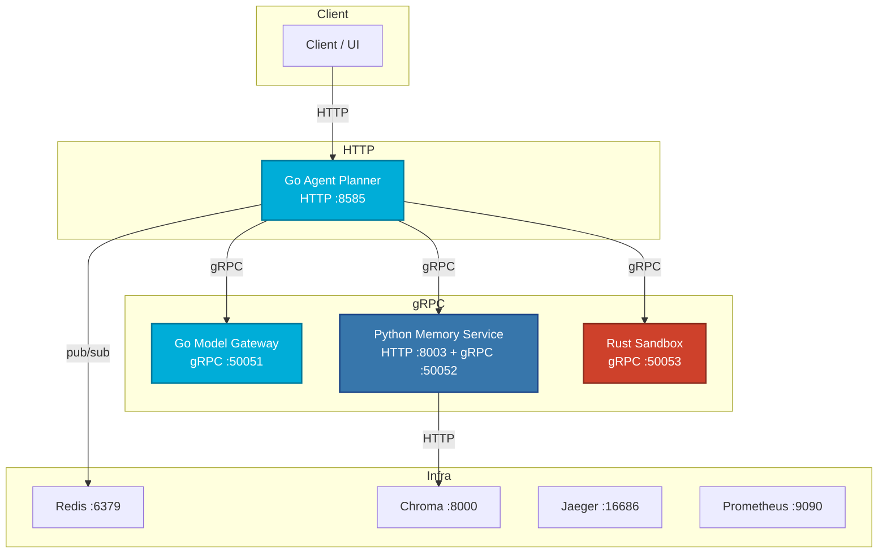
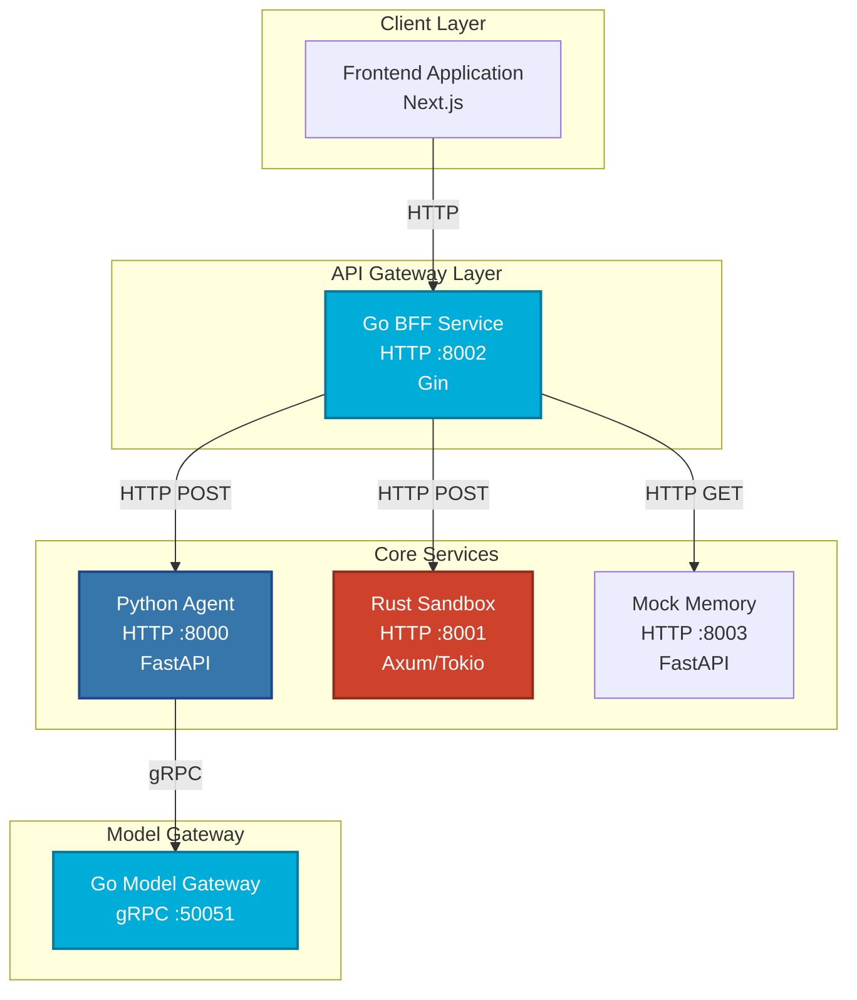
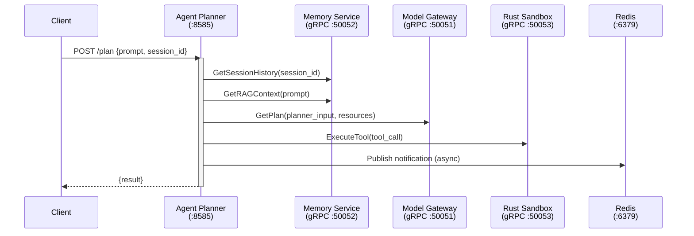
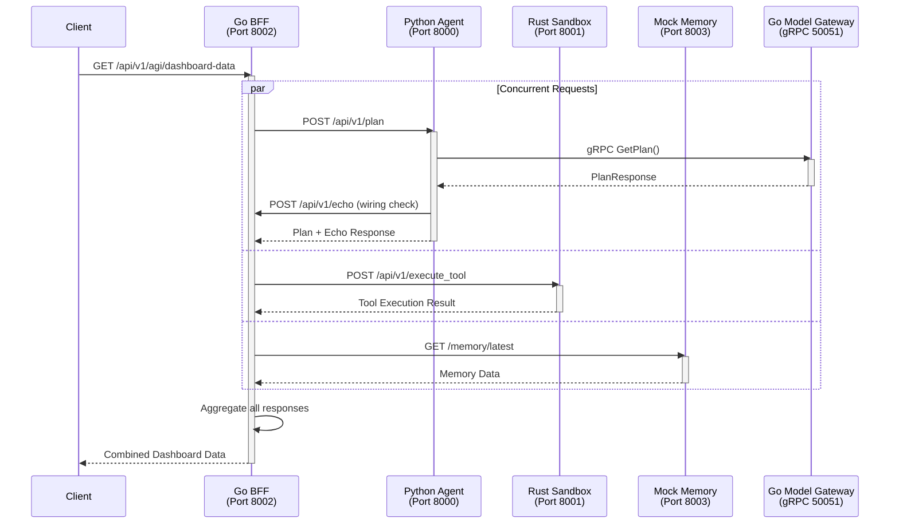
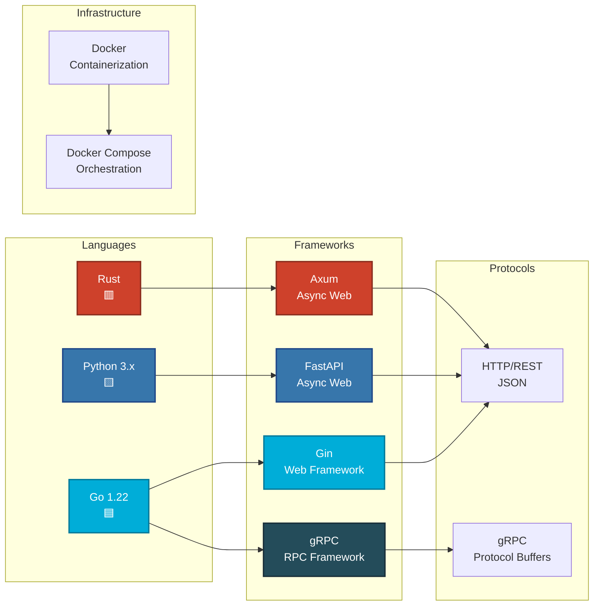
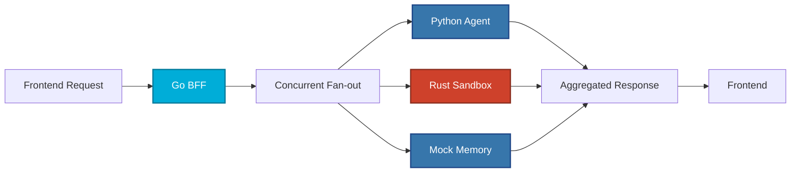
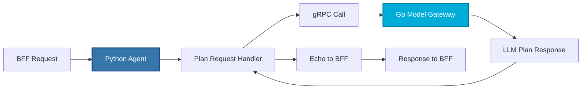
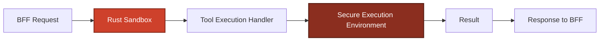
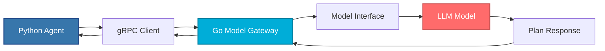

# PAGI Chat Desktop - Comprehensive Guide

> **A polyglot microservices architecture** designed for fast iteration on an **agent + tools + gateway + memory** backend system.

---

## Table of Contents

1. [Overview](#overview)
2. [Architecture Diagram](#architecture-diagram)
3. [Services Overview](#services-overview)
4. [Request Flow](#request-flow)
5. [Technology Stack](#technology-stack)
6. [Getting Started](#getting-started)
7. [Service Details](#service-details)
8. [API Endpoints](#api-endpoints)
9. [Development Guide](#development-guide)
10. [Troubleshooting](#troubleshooting)

---

## Overview

This backend system is built using **multiple programming languages** (polyglot architecture) to leverage the strengths of each language:

- **Go** for high-performance HTTP services and gRPC gateways
- **Python** for memory services and rapid prototyping
- **Rust** for secure, sandboxed tool execution
- **gRPC** for efficient inter-service communication

The system follows a **microservices architecture** where each service has a specific responsibility and communicates with others through well-defined APIs.

### Runtime profiles

This repo supports two runnable “profiles”:

1. **Bare Metal (recommended / current core stack)**
   - Runs the Go **Agent Planner** + Go **Model Gateway** + Python **Memory Service** + Rust **Sandbox** via [`scripts/run_all_dev.py`](scripts/run_all_dev.py:1)
   - Designed to be **UI-agnostic** (your future Google AI Studio UI can call the Agent Planner HTTP API)
2. **Docker Compose (optional)**
   - Runs the same core services plus optional infra (Redis + observability) via [`docker-compose.yml`](docker-compose.yml:1)
3. **Bare-metal dev harness (legacy demo stack)**
   - Runs the Go **BFF** + Python **Agent** demo stack via [`scripts/run_all_dev.py`](scripts/run_all_dev.py:1) (`--profile legacy`)
   - The placeholder Next.js folder ([`frontend-nextjs-agent-ui/package.json`](frontend-nextjs-agent-ui/package.json:1)) is **not wired into the current core stack** and can be ignored/removed for your new frontend.

---

## Architecture Diagram

### Docker Compose profile (Agent Planner stack)



### Bare-metal dev harness profile (BFF + Python Agent demo)

> This is the older “fan-out BFF” demo stack started by [`make run-legacy-dev`](Makefile:1) / [`scripts/run_all_dev.py`](scripts/run_all_dev.py:1).



---

## Services Overview

### Docker Compose profile services

| Service | Language | Framework | Ports | Purpose |
|---------|----------|-----------|-------|---------|
| **Go Agent Planner** | Go | chi | 8585 (host) / 8080 (container) | Primary HTTP entrypoint: agent loop (RAG + tools + audit + notifications) |
| **Go Model Gateway** | Go | gRPC | 50051 (host + container) | LLM model gateway (gRPC service) |
| **Memory Service** | Python | FastAPI | 8003 (HTTP host) + 50052 (gRPC internal) | Session history + RAG context (backed by Chroma) |
| **Rust Sandbox** | Rust | Axum + gRPC | 50053 (gRPC host) + 8001 (HTTP internal) | Secure tool execution |
| **Chroma DB** | N/A | chroma | 8000 | Vector store backend for RAG |
| **Redis** | N/A | redis | 6379 | Async notifications channel |
| **Notification Service** | Go | N/A | N/A | Subscribes to Redis `pagi_notifications` and prints messages |
| **Jaeger** | N/A | jaeger | 16686 / 4317 / 4318 | Distributed tracing |
| **Prometheus** | N/A | prometheus | 9090 | Metrics scraping |

### Bare-metal dev harness services

| Service | Language | Framework | Port | Purpose |
|---------|----------|-----------|------|---------|
| **Go BFF** | Go | Gin | 8002 | Fan-out aggregator for demo UI |
| **Python Agent** | Python | FastAPI | 8000 | Demo agent planning (calls model gateway) |
| **Rust Sandbox** | Rust | Axum/Tokio | 8001 | Demo HTTP tool execution |
| **Mock Memory** | Python | FastAPI | 8003 | Mock memory service for local dev demo |
| **Go Model Gateway** | Go | gRPC | 50051 | LLM model gateway (gRPC service) |

---

## Request Flow

### Agent Planner request flow (Docker Compose profile)



### Main Dashboard request flow (Bare-metal dev harness)



**Key Points:**
- The BFF makes **3 concurrent requests** to improve performance
- Python Agent calls Model Gateway via **gRPC** (faster than HTTP)
- The echo call is a **non-recursive wiring check** to verify connectivity

---

## Technology Stack



---

## Getting Started

### Prerequisites

Before you begin, ensure you have the following installed:

- **Python 3.8+** with `pip`
- **Go 1.22+**
- **Rust** (latest stable version)
- **Docker** and **Docker Compose** (for containerized deployment)
- **Make** (optional, for convenience commands)

### Quick Start (Bare Metal - Recommended)

This is the **current core stack** (Agent Planner + Model Gateway + Memory Service + Sandbox) as started by [`scripts/run_all_dev.py`](scripts/run_all_dev.py:1).

```bash
# 0. (Optional) copy env template
# Linux/macOS/WSL/Git Bash:
#   cp .env.example .env
# Windows (cmd.exe):
#   copy .env.example .env

# Example (bash):
cp .env.example .env

# 1. Start everything
# NOTE: This boots with LLM_PROVIDER=mock by default (no API keys needed).
python scripts/run_all_dev.py --profile core

# Or (if you have Make):
make run-dev

# 2. Verify core endpoints
curl http://localhost:8585/health
curl http://localhost:8003/health

# 3. Run a plan (Agent Planner)
curl -X POST http://localhost:8585/plan -H "Content-Type: application/json" -d "{\"prompt\":\"Say hello and summarize system status\",\"session_id\":\"demo\",\"resources\":[] }"
```

### Docker Compose (Optional)

If you prefer Docker orchestration (plus optional infra like Redis/Jaeger/Prometheus), use [`docker-compose.yml`](docker-compose.yml:1):

```bash
docker compose up --build
```

### E2E Verification (Trace ID + Async Notification + Audit Log)

An automated end-to-end script is provided to validate:

- `X-Trace-ID` propagation on the Agent Planner HTTP response
- notification delivery via Redis (`notification-service` logs contain the trace id)
- structured audit log persistence (SQLite rows exist for the trace id)

```bash
# NOTE: run in a bash-compatible shell (Linux/macOS, WSL, or Git Bash)
bash scripts/verify_e2e_audit.sh
```

**To stop all services:**
```bash
docker compose down
```

### Legacy Dev Harness (BFF + Python Agent demo)

For local development without Docker:

#### Step 1: Install Dependencies

**Python Services:**
```bash
# Create virtual environment
python -m venv .venv

# Activate virtual environment
# On Windows:
.venv\Scripts\activate
# On Linux/Mac:
source .venv/bin/activate

# Install Python dependencies
pip install -r backend-python-agent/requirements.txt
```

**Go Services:**
```bash
# Verify Go installation
go version

# Install Go dependencies (automatic on first run)
cd backend-go-bff && go mod download
cd ../backend-go-model-gateway && go mod download
```

**Rust Service:**
```bash
# Verify Rust installation
cargo --version

# Dependencies are managed by Cargo.toml
```

#### Step 2: Generate gRPC Stubs

```bash
# Generate Go gRPC code
make docker-generate

# Or manually:
cd backend-go-model-gateway
go generate ./...
```

#### Step 3: Run All Services

```bash
# Start the legacy demo stack (BFF + Python Agent + Rust Sandbox + Mock Memory + Model Gateway)
make run-legacy-dev

# Or manually run each service in separate terminals:
# Terminal 1: Python Agent
cd backend-python-agent
uvicorn main:app --host 127.0.0.1 --port 8000

# Terminal 2: Rust Sandbox
cd backend-rust-sandbox
cargo run

# Terminal 3: Go BFF
cd backend-go-bff
go run .

# Terminal 4: Mock Memory
cd scripts
uvicorn mock_memory_service:app --host 127.0.0.1 --port 8003

# Terminal 5: Go Model Gateway
cd backend-go-model-gateway
go run .
```

**To stop all services:**
```bash
make stop-legacy-dev
```

---

## 🔍 Service Details

### 1. Go BFF (Backend for Frontend) - Port 8002

**Purpose:** Acts as a single entry point for the frontend, aggregating data from multiple backend services.

**Key Features:**
- ✅ Concurrent request handling (fan-out pattern)
- ✅ Request ID propagation for tracing
- ✅ Structured JSON logging
- ✅ Health check endpoint

**Technology:**
- **Framework:** Gin (Go web framework)
- **Pattern:** BFF (Backend for Frontend)



**Why Go for BFF?**
- High performance and low latency
- Excellent concurrency support (goroutines)
- Efficient memory usage
- Perfect for aggregating multiple services

---

### 2. Python Agent - Port 8000

**Purpose:** Handles agent planning logic and orchestrates LLM interactions.

**Key Features:**
- ✅ Agent planning endpoint
- ✅ gRPC client for model gateway
- ✅ HTTP client for BFF communication
- ✅ Structured logging middleware

**Technology:**
- **Framework:** FastAPI (async Python web framework)
- **Communication:** HTTP REST + gRPC



**Why Python for Agent?**
- Rich AI/ML ecosystem (TensorFlow, PyTorch, etc.)
- Rapid prototyping and iteration
- Excellent libraries for NLP and AI
- Easy integration with LLM APIs

---

### 3. Rust Sandbox - Port 8001

**Purpose:** Provides a secure environment for executing tools and code safely.

**Key Features:**
- ✅ Secure code execution
- ✅ Tool execution endpoint
- ✅ Structured JSON logging
- ✅ Request ID tracking

**Technology:**
- **Framework:** Axum (async Rust web framework)
- **Runtime:** Tokio (async runtime)



**Why Rust for Sandbox?**
- Memory safety without garbage collection
- Zero-cost abstractions
- Strong security guarantees
- Perfect for sandboxed execution
- Prevents common vulnerabilities (buffer overflows, etc.)

---

### 4. Go Model Gateway - Port 50051 (gRPC)

**Purpose:** Interfaces with LLM models and provides a unified gateway for AI model interactions.

**Key Features:**
- ✅ gRPC service (high performance)
- ✅ Plan generation endpoint
- ✅ Model abstraction layer
- ✅ Latency tracking

**Technology:**
- **Framework:** gRPC (Go implementation)
- **Protocol:** Protocol Buffers



**Why gRPC?**
- **Performance:** Binary protocol (faster than JSON)
- **Type Safety:** Protocol Buffers provide strong typing
- **Streaming:** Supports bidirectional streaming
- **Efficiency:** Lower latency and bandwidth usage

**Why Go for Gateway?**
- Excellent gRPC support
- High throughput
- Low latency
- Perfect for gateway patterns

---

### 5. Mock Memory Service - Port 8003

**Purpose:** Provides mock memory storage for testing and development.

**Key Features:**
- ✅ Mock memory endpoint
- ✅ Health check
- ✅ FastAPI-based

**Technology:**
- **Framework:** FastAPI

---

## API Endpoints

### Go Agent Planner (Docker Compose profile; host port 8585)

| Method | Endpoint | Description | Auth |
|--------|----------|-------------|------|
| `GET` | `/health` | Health check | none |
| `GET` | `/metrics` | Prometheus metrics | none |
| `POST` | `/plan` | Run the agent loop | optional `X-API-Key` |
| `POST` | `/run` | Alias for `/plan` | optional `X-API-Key` |

**Example request:**

```bash
curl -X POST http://localhost:8585/plan -H "Content-Type: application/json" -H "X-Trace-ID: test-trace-123" -d "{\"prompt\":\"Generate a 3-step plan\",\"session_id\":\"s1\",\"resources\":[] }"
```

> **Auth note:** If `PAGI_API_KEY` is set (see [`.env.example`](.env.example:1)), requests require `X-API-Key: <key>` (or `Authorization: Bearer <key>`). If not set, auth is **disabled** (dev mode).

### Go BFF (Bare-metal dev harness; port 8002)

| Method | Endpoint | Description | Request Body | Response |
|--------|----------|-------------|--------------|----------|
| `GET` | `/health` | Health check | - | `{service, status, version}` |
| `POST` | `/api/v1/echo` | Echo endpoint for wiring checks | `{ping, request_id}` | `{service, received, request_id}` |
| `GET` | `/api/v1/agi/dashboard-data` | Aggregates data from all services | - | `{service, status, request_id, data}` |

**Example Request:**
```bash
curl -X GET http://localhost:8002/api/v1/agi/dashboard-data \
  -H "X-Request-Id: test-123"
```

**Example Response:**
```json
{
  "service": "backend-go-bff",
  "status": "ok",
  "request_id": "test-123",
  "data": {
    "python_agent": {...},
    "rust_sandbox": {...},
    "memory": {...}
  }
}
```

---

### Python Agent (Port 8000)

| Method | Endpoint | Description | Request Body | Response |
|--------|----------|-------------|--------------|----------|
| `GET` | `/health` | Health check | - | `{service, status, version}` |
| `POST` | `/api/v1/plan` | Generate agent plan | `{prompt: string}` | `{service, status, plan, llm_response, bff_echo}` |

**Example Request:**
```bash
curl -X POST http://localhost:8000/api/v1/plan \
  -H "Content-Type: application/json" \
  -H "X-Request-Id: test-456" \
  -d '{"prompt": "Generate a 3-step plan to solve X"}'
```

---

### Rust Sandbox (Port 8001)

| Method | Endpoint | Description | Request Body | Response |
|--------|----------|-------------|--------------|----------|
| `GET` | `/health` | Health check | - | `{service, status, version}` |
| `POST` | `/api/v1/execute_tool` | Execute a tool | `{tool_name: string, code?: string}` | `{tool_status, result}` |

**Example Request:**
```bash
curl -X POST http://localhost:8001/api/v1/execute_tool \
  -H "Content-Type: application/json" \
  -H "X-Request-Id: test-789" \
  -d '{"tool_name": "demo"}'
```

---

### Mock Memory (Bare-metal dev harness; port 8003)

| Method | Endpoint | Description | Request Body | Response |
|--------|----------|-------------|--------------|----------|
| `GET` | `/health` | Health check | - | `{service, status, version}` |
| `GET` | `/memory/latest` | Get latest memory | - | Memory data |

---

## Development Guide

### Project Structure

```
pagi-chat-desktop/
├── pagi-chat-desktop-backend/   # NEW: Rust API wrapper (HTTP/WebSocket) for the companion core
├── backend-go-agent-planner/   # Agent Planner (primary HTTP entrypoint)
├── backend-go-bff/             # Go BFF service (bare-metal demo)
├── backend-go-model-gateway/   # Go gRPC model gateway
├── backend-go-notification-service/
├── backend-python-agent/       # Python agent service (bare-metal demo)
├── backend-python-memory/      # Memory Service (HTTP + gRPC)
├── backend-rust-sandbox/       # Rust sandbox service
├── docs/
├── knowledge_bases/
├── observability/
├── scripts/                    # Utility scripts (includes bare-metal dev harness)
├── docker-compose.yml          # Docker orchestration
├── Makefile                    # Convenience commands
└── README.md                   # This file
```

### Environment Variables

Create a `.env` file (optional; defaults exist). Start with [`.env.example`](.env.example:1).

```bash
# Service Ports (bare-metal harness)
PY_AGENT_PORT=8000
RUST_SANDBOX_PORT=8001
GO_BFF_PORT=8002
MEMORY_MOCK_PORT=8003
MODEL_GATEWAY_GRPC_PORT=50051

# Service URLs (for bare metal)
PY_AGENT_URL=http://localhost:8000
RUST_SANDBOX_URL=http://localhost:8001
GO_BFF_URL=http://localhost:8002
MEMORY_URL=http://localhost:8003
MODEL_GATEWAY_GRPC_HOST=localhost

# Timeouts
REQUEST_TIMEOUT_SECONDS=2
MODEL_GATEWAY_GRPC_TIMEOUT_SECONDS=5

# Logging
LOG_LEVEL=info

# SECURITY (Agent Planner)
# If set, Agent Planner requires X-API-Key (or Authorization: Bearer)
PAGI_API_KEY=
```

### mTLS for internal gRPC (research/testing)

The Go **Agent Planner** ↔ Go **Model Gateway** gRPC connection supports **mutual TLS (mTLS)**.

For Docker Compose, mTLS is **disabled by default** so first-time setup is frictionless.

To enable it:

1) Generate test certs into `./tls_certs` via [`scripts/gen_certs.sh`](scripts/gen_certs.sh:1)
2) Add the `TLS_*` environment variables for `model-gateway` and `agent-planner` (see [`.env.example`](.env.example:1))
3) Mount `./tls_certs:/app/tls_certs:ro` into both services (compose override recommended)

Generate test certs (self-signed) with [`scripts/gen_certs.sh`](scripts/gen_certs.sh:1):

```bash
# NOTE: run in a bash-compatible shell (Linux/macOS, WSL, or Git Bash)
bash scripts/gen_certs.sh
```

Environment variables used:

- **Model Gateway (server-side)**
  - `TLS_SERVER_CERT_PATH=/app/tls_certs/server.crt`
  - `TLS_SERVER_KEY_PATH=/app/tls_certs/server.key`
  - `TLS_CA_CERT_PATH=/app/tls_certs/ca.crt`

- **Agent Planner (client-side)**
  - `TLS_CLIENT_CERT_PATH=/app/tls_certs/client.crt`
  - `TLS_CLIENT_KEY_PATH=/app/tls_certs/client.key`
  - `TLS_CA_CERT_PATH=/app/tls_certs/ca.crt`

Bare-metal runs will stay **insecure by default** unless the `TLS_*` variables are set.

### Adding a New Service

1. **Create service directory:**
   ```bash
   mkdir backend-new-service
   cd backend-new-service
   ```

2. **Add to docker-compose.yml:**
   ```yaml
   pagi-new-service:
     container_name: pagi-new-service
     build:
       context: ./backend-new-service
     environment:
       - NEW_SERVICE_PORT=8004
     ports:
       - "8004:8004"
   ```

3. **Add to scripts/run_all_dev.py:**
   ```python
   {
       "name": "New Service",
       "dir": "backend-new-service",
       "cmd": ["go", "run", "."],
       "port": "8004",
       "health_url": "http://localhost:8004/health",
   }
   ```

### Debugging Tips

1. **Check service logs:**
    ```bash
    # Docker Compose
    docker compose logs -f agent-planner
    docker compose logs -f model-gateway
    docker compose logs -f memory-service
    
    # Bare metal - logs are printed to stdout
    ```

2. **Test individual services:**
   ```bash
   # Health checks
   curl http://localhost:8000/health
   curl http://localhost:8001/health
   curl http://localhost:8002/health
   ```

3. **Verify gRPC connection:**
   ```bash
   # Install grpcurl
   go install github.com/fullstorydev/grpcurl/cmd/grpcurl@latest
   
   # Test gRPC endpoint
   grpcurl -plaintext localhost:50051 list
   ```

---

## 🔧 Troubleshooting

### Common Issues

#### 1. Port Already in Use

**Problem:** Service fails to start because port is already in use.

**Solution:**
```bash
# Find process using port (Windows)
netstat -ano | findstr :8000

# Kill process (Windows)
taskkill /PID <pid> /F

# Or change port in .env file
PY_AGENT_PORT=8005
```

#### 2. gRPC Stubs Missing (Bare Metal)

**Problem:** `go run .` fails with "missing gRPC stubs" error.

**Solution:**
```bash
# Generate gRPC stubs
make docker-generate

# Or manually:
cd backend-go-model-gateway
go generate ./...
```

#### 3. Service Not Responding

**Problem:** Service starts but health check fails.

**Solution:**
1. Check service logs for errors
2. Verify environment variables are set correctly
3. Ensure all dependencies are installed
4. Check firewall settings

#### 4. Docker Networking Issues

**Problem:** Services can't communicate in Docker.

**Solution:**
- Services in Docker Compose use service names (e.g., `model-gateway:50051`, `memory-service:50052`)
- Ensure service names match in `docker-compose.yml`
- Check `depends_on` and `healthcheck` configurations

#### 5. Python Virtual Environment Issues

**Problem:** Python packages not found.

**Solution:**
```bash
# Recreate virtual environment
rm -rf .venv
python -m venv .venv
source .venv/bin/activate  # or .venv\Scripts\activate on Windows
pip install -r backend-python-agent/requirements.txt
```

---

## 📚 Learning Resources

### For Junior Developers

**Understanding Microservices:**
- [Microservices.io Patterns](https://microservices.io/patterns/index.html)
- [Martin Fowler on Microservices](https://martinfowler.com/articles/microservices.html)

**Go:**
- [Go by Example](https://gobyexample.com/)
- [Effective Go](https://go.dev/doc/effective_go)

**Python:**
- [FastAPI Documentation](https://fastapi.tiangolo.com/)
- [Python Async/Await](https://docs.python.org/3/library/asyncio.html)

**Rust:**
- [The Rust Book](https://doc.rust-lang.org/book/)
- [Axum Documentation](https://docs.rs/axum/)

**gRPC:**
- [gRPC Documentation](https://grpc.io/docs/)
- [Protocol Buffers Guide](https://developers.google.com/protocol-buffers)

---

## 🤝 Contributing

1. Create a feature branch
2. Make your changes
3. Test thoroughly
4. Submit a pull request

---

## 📝 License

[Add your license information here]

---

## 🎓 Key Concepts Explained

### What is a BFF (Backend for Frontend)?

A **BFF** is a service that sits between the frontend and multiple backend services. It:
- Aggregates data from multiple sources
- Reduces frontend complexity
- Optimizes data transfer
- Provides a single API for the frontend

### Why Polyglot Architecture?

Different languages excel at different tasks:
- **Go:** High performance, concurrency
- **Python:** AI/ML, rapid development
- **Rust:** Security, performance, memory safety

### What is gRPC?

**gRPC** is a high-performance RPC (Remote Procedure Call) framework:
- Uses Protocol Buffers (binary format)
- Faster than JSON-based REST APIs
- Supports streaming
- Strongly typed

### What are Knowledge Bases (KBs)?

PAGI is designed around a flexible, multi-KB memory architecture. The key idea is that the KB structure (Domain, Body, Soul, Heart, Mind) acts like a **template** that you populate differently for each **Use Case / Agent Persona**.

#### Stubbing a new Use Case (how to “plug in” a new persona)

At a high level, a “use case” in this backend is just:

1) **A persona + constraints** (Soul-KB)

2) **Some domain documents** (Domain-KB)

3) **A tool/environment contract** (Body-KB)

4) A **session_id** to keep episodic history isolated (Heart-KB)

5) Optionally, accumulated playbooks (Mind-KB)

Today, the Agent Planner stack expects the KBs to live in Chroma collections named `Domain-KB`, `Body-KB`, and `Soul-KB` (see `RAG_KNOWLEDGE_BASES` in [`backend-python-memory/memory_service.py`](backend-python-memory/memory_service.py:22)). The quickest way to stub a brand-new use case is:

**Step A — Write your KB content as files (recommended source-of-truth)**

- Put persona text under [`knowledge_bases/Soul-KB/`](knowledge_bases/Soul-KB/:1)
- Put domain docs under [`knowledge_bases/Domain-KB/`](knowledge_bases/Domain-KB/:1)
- Put tool specs / environment docs under [`knowledge_bases/Body-KB/`](knowledge_bases/Body-KB/:1)

**Step B — Ingest those documents into Chroma**

The memory service does **not** automatically ingest files yet; it only seeds each collection with a placeholder record at startup (see [`seed_rag_collections()`](backend-python-memory/memory_service.py:148)). For now, ingest via a small one-off script (run it anywhere you can reach Chroma):

```python
import os
from pathlib import Path

import chromadb
from sentence_transformers import SentenceTransformer

CHROMA_HOST = os.environ.get("CHROMA_HOST", "localhost")
CHROMA_PORT = int(os.environ.get("CHROMA_PORT", "8000"))

client = chromadb.HttpClient(host=CHROMA_HOST, port=CHROMA_PORT)
embed_model = SentenceTransformer(os.environ.get("EMBEDDING_MODEL_NAME", "all-MiniLM-L6-v2"))

def embed(texts):
    return embed_model.encode(texts, convert_to_numpy=True).tolist()

def ingest_dir(collection_name: str, dir_path: str):
    col = client.get_or_create_collection(name=collection_name)
    docs = []
    ids = []
    for p in sorted(Path(dir_path).glob("**/*")):
        if p.is_file():
            docs.append(p.read_text(encoding="utf-8"))
            ids.append(f"{collection_name}:{p.as_posix()}")
    if not docs:
        return
    col.upsert(ids=ids, documents=docs, embeddings=embed(docs))

ingest_dir("Soul-KB", "knowledge_bases/Soul-KB")
ingest_dir("Domain-KB", "knowledge_bases/Domain-KB")
ingest_dir("Body-KB", "knowledge_bases/Body-KB")
print("Ingest complete")
```

**Step C — Add/extend tools (optional, but common)**

- Add the tool schema so the planner can call it: update `availableTools` in [`backend-go-model-gateway/main.go`](backend-go-model-gateway/main.go:97)
- Implement the tool in the Rust sandbox dispatcher: [`execute_internal_tool()`](backend-rust-sandbox/src/tool_executor.rs:123) (and add a module like [`backend-rust-sandbox/src/tool_web_search.rs`](backend-rust-sandbox/src/tool_web_search.rs:1))

**Step D — Run the use case**

Call the Agent Planner with a new `session_id` for that persona:

```bash
curl -X POST http://localhost:8585/plan -H "Content-Type: application/json" -d "{\"prompt\":\"<your use case prompt>\",\"session_id\":\"usecase-1\",\"resources\":[] }"
```

> Note: The current RAG retrieval does not yet “namespace” KBs by use case. If you want multiple personas simultaneously, the simplest approach today is to run separate Chroma instances/volumes per use case (or extend the memory service to maintain per-use-case collections).

#### 🧠 Knowledge Base Template for PAGI Use Cases

The template for creating a full Knowledge Base set relies on defining the agent's **Role** (its purpose), **Memory** (what it knows), and **Personality** (how it interacts).

| KB Name | Type of Information | Purpose in the Agent Loop | Template Content Direction |
| --- | --- | --- | --- |
| **1. Soul-KB** | **Identity/Core Values** (Hard-Coded) | Defines the agent's personality, core safety rules, and ethical boundaries. **Never changes.** | **Persona:** Name, gender, age (optional). **Mission:** Primary goal of the agent (e.g., "Maintain home security," "Provide marketing insights"). **Constraint:** Rules to prevent unsafe or out-of-scope actions (e.g., "Do not control physical devices," "Do not share customer data"). |
| **2. Domain-KB** | **Expertise** (RAG/Vector) | Comprehensive, technical knowledge specific to the use case. | **Technical Manuals:** APIs, SDK documentation, protocols (e.g., Zigbee, Wi-Fi 6). **Industry Data:** Market trends, legal compliance, specific company policies. |
| **3. Body-KB** | **Tool/Environment State** (RAG/Vector) | Information about the agent's current environment and tool capabilities. | **Tool Specs:** Detailed documentation for every available tool (e.g., `web_search`, `code_sandbox`, `control_device`). **System Status:** Sensor readings, device inventory, network topology. |
| **4. Heart-KB** | **Episodic Memory** (SQLite) | **Session History.** The agent's short-term recall of the current conversation. | **(Dynamically Populated):** Stores the conversation history (`user`, `assistant`, `tool-plan`, `tool-output`) for the active session ID. |
| **5. Mind-KB** | **Evolving Playbooks** (RAG/Vector) | **Learned Expertise.** Successful sequences for solving complex, multi-step problems. | **(Dynamically Populated):** Stores sequences of successful tool usage (e.g., "Playbook: Web search for price, then calculate tax."). |

#### 🎯 Directions for Specific Use Cases

Below are examples of how to populate the KBs for distinct personas.

##### 1) 🐶 AI Pet Toy Dog (Companion)

| KB | Content Direction |
| --- | --- |
| **Soul-KB** | **Persona:** "You are a cheerful, loyal Golden Retriever named Barky." **Mission:** "Provide playful interaction and emotional support." **Constraint:** "Speak only in short, enthusiastic, positive sentences." |
| **Domain-KB** | Documents on **dog psychology**, common pet phrases, commands ("fetch," "stay"), and perhaps a local schedule for the owner (if granted access). |
| **Body-KB** | Documentation for **voice recognition APIs**, status of the physical actuators (legs, tail), and battery level reporting. |
| **Mind-KB** | Playbooks for successfully executing complex behaviors, e.g., "How to execute a 4-step 'fetch' command." |

##### 2) 🤖 Agentic AI Desktop (Productivity/Research)

| KB | Content Direction |
| --- | --- |
| **Soul-KB** | **Persona:** "You are a neutral, highly efficient research assistant." **Mission:** "Synthesize information and manage the user's digital environment." **Constraint:** "Always cite sources. Never access personal files unless explicitly requested." |
| **Domain-KB** | **Research methodologies**, statistical analysis guides, specific **company coding standards** (for a developer). |
| **Body-KB** | Full API docs for **filesystem access**, available **external tools** (e.g., `git`, `code_interpreter`), and operating system commands. |
| **Mind-KB** | Playbooks for complex tasks, e.g., "Process: Find three news articles, summarize, and commit the summary to a file." |

##### 3) 🏠 Home Security AI System

| KB | Content Direction |
| --- | --- |
| **Soul-KB** | **Persona:** "You are the primary, objective security controller." **Mission:** "Maintain the safety and privacy of the household." **Constraint:** "Do not allow remote disabling of alarms without biometric confirmation. Prioritize safety over convenience." |
| **Domain-KB** | **Security protocols** (e.g., lock-down procedures), **threat analysis** models, local police contact protocols. |
| **Body-KB** | List of all **installed sensors** (cameras, door locks), their current **state**, and documentation for the alarm API. |
| **Mind-KB** | Playbooks for complex responses, e.g., "If motion is detected at 3 AM and the owner is away, flash the lights and notify emergency contacts." |

By populating the five KB types with use-case-specific details, you can change the agent's behavior, identity, and capabilities without changing the underlying Go/Rust/Python code (a **context-as-a-compiler** approach).

---

#### KB authoring (examples)

The repository contains starter KB folders under [`knowledge_bases/`](knowledge_bases/:1). If you want to keep large “prompt templates” in the README, they’re kept below in a collapsed block.

<details>
<summary><strong>KB prompt templates (examples)</strong></summary>

The following are example prompts/templates for generating KB content (Soul/Domain/Body). They are **not required** to run the services.

1) AI Pet Toy Dog persona

2) Agentic AI Desktop persona

3) Home Security persona

4) Digital Twin Cybersecurity Manager persona

</details>

### What is a Microservice?

A **microservice** is a small, independent service that:
- Has its own database (if needed)
- Can be deployed independently
- Communicates via APIs
- Focuses on a single business capability

---

## Support

For questions or issues:
1. Check the [Troubleshooting](#troubleshooting) section
2. Review service logs
3. Open an issue on the repository

---

**Happy building.**
